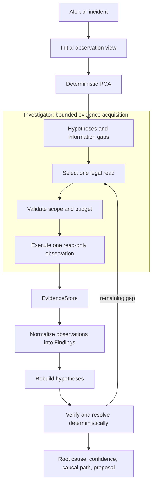

# Agentic SRE — Deterministic Root Cause Analysis for Kubernetes Incidents

Agentic SRE is an evidence-driven root-cause analysis engine for Kubernetes
incidents. It performs bounded, read-only investigation over changes, events,
logs, traces, dependencies, and topology, then rebuilds hypotheses and makes
the final root-cause judgment deterministically. An LLM is optional; it never
owns the diagnosis.

```text
Alert → evidence → hypotheses → bounded investigation → deterministic judgment
```

[](https://github.com/negativexq/agentic-sre/actions/workflows/checks.yml)
[](https://www.python.org/)
[](LICENSE)

### At a glance

- **Blind TEST25 holdout: [17/22 scoreable = 77.3%](evals/results/v1.1.2/README.md); 0 model calls.** This is the primary ITBench-Lite accuracy measurement.
- **DEV + holdout combined: 26/31 = 83.9%.** Four unmatchable published labels are excluded from the denominator.
- **Live suite: 25/25 expected outcomes** — 16/16 correct root-cause actors, 9/9 correct abstentions, and 0 fabricated `RESOLVED` diagnoses. Actor identification and epistemic resolution are separate: `RESOLVED` 0, `AMBIGUOUS` 14, `INSUFFICIENT_EVIDENCE` 11. See the [live-suite report](evals/results/live-suite-2026-09-24.md) and [M16 validation](docs/results/m16-positive-elimination.md).
- **0 model calls** — in both reported measurements; deterministic judgment remains authoritative.
- **Bounded investigation** — the frozen TEST25 run used six validated physical reads per incident, one read at a time.
- **Evidence-backed RCA** — observations become normalized Findings before they can change a diagnosis.
- **Read-only by design** — the RCA investigator cannot mutate the cluster or execute remediation. The live benchmark harness separately stages and restores test faults.

## Measured root-cause performance

The current frozen architecture was evaluated against ITBench-Lite ground
truth with exact canonical entity comparison. The blind TEST25 result is the
primary public measurement; the development split is shown separately so
development evidence is not confused with holdout evidence.

Four of the 35 published labels cannot be matched by any prediction: their
entity filters match nothing in the scenario's own snapshot (Scenario-29, 23,
38, 105; Scenario-38's filter is not even a valid expression). Those four are
excluded from the accuracy denominator and reported separately.

| Evaluation | Exact root-cause accuracy | Raw | Model calls |
| --- | ---: | ---: | ---: |
| DEV10 development split | 9/9 (100%) | 9/10 | 0 |
| **Blind TEST25 holdout (primary)** | **[17/22 (77.3%)](evals/results/v1.1.2/README.md)** | 17/25 | **0** |
| DEV + holdout combined | 26/31 (83.9%) | 26/35 | 0 |

Confidence against ground truth on the 31 scoreable scenarios: `VERIFIED`
predictions were 13/16 correct and `LIKELY` predictions 13/19.

These accuracy figures are measured on the deterministic full-source path. The
bounded investigation path is measured separately, by how often it reaches the
same answer as the full-source path (21/25 on TEST25); its own ground-truth
accuracy has not been established.

On the frozen TEST25 run, every scenario used six validated physical reads:
150 reads across 25 incidents. The run produced 2,226 new evidence references and 244
normalized Finding emissions. The detailed [frozen benchmark report](evals/results/v1.1.2/README.md)
contains the dataset revision, manifest hash, prediction-freeze procedure, and
full aggregate metrics.

### Live scenario suite

ITBench-Lite grades root-cause accuracy on frozen snapshots. The internal live
scenario suite instead stages 25 real faults on a running Kubernetes cluster —
config, image, scale, NetworkPolicy, resource-starvation, deletion, crash, and
runtime-only faults — lets the real alerting path open an incident, and grades
the diagnosis the control plane actually stored.

| Tier | Scenarios | Correct |
| --- | ---: | ---: |
| DEV | 19 | 19 |
| **HOLDOUT** | **6** | **6** |
| **Total expected outcomes** | **25** | **25/25** |

The published 2026-09-24 live-suite re-anchor evaluated
`da6f0e671775e3ddba9374d3b2fd46e678478a56`. The frozen 25-scenario protocol was
later rerun during M16 validation at `b982c40`, preserving the same 25/25
expected outcomes and resolution distribution. Across that result, 16/16
root-cause actors and 9/9 abstentions were correct, with 0 fabricated
`RESOLVED` diagnoses. The resolution distribution was `RESOLVED`: 0,
`AMBIGUOUS`: 14, `INSUFFICIENT_EVIDENCE`: 11. Correct actor identification and
final epistemic resolution are distinct; the suite records the former even
when available evidence supports only an unresolved diagnosis. The result has
0 model calls. G16.7 remains historically `NOT MET`.

This separate in-house measurement uses labels with no external validity and
is not combined with ITBench-Lite. See the [methodology](docs/benchmarks/live-suite.md)
for scope and `make live-bench` to reproduce the protocol.

## What is Agentic SRE?

Agentic SRE is a Kubernetes incident investigation and SRE root-cause
analysis system. It starts from an alert and an observation cutoff, identifies
candidate causal actors, explains how they can reach the affected workload, and
tests unresolved questions with a bounded set of legal read-only observations.

The investigator gathers evidence; it does not decide the root cause. Every
new observation returns through the same deterministic path:

```text
observation → EvidenceStore → normalization → Finding
            → hypothesis rebuild → verification → resolution
```

This separation makes an investigation auditable. A diagnosis includes the
selected root entity, confidence, resolution state, evidence, and causal path;
it does not rely on an opaque model answer.

## Why Agentic SRE?

### Evidence before answers

The engine does not ask a model to guess what caused an incident. It acquires
bounded evidence, normalizes that evidence into typed Findings, and rebuilds
the deterministic diagnosis.

### Deterministic judgment

The RCA engine owns verification, confidence, resolution, and root-cause
selection. An optional policy can choose among already-legal observation
actions, but it cannot create evidence, Findings, hypotheses, or a root cause.

### Bounded autonomous investigation

Investigation is a controlled state machine with explicit turn, tool, wall-time,
per-gap, invalid-action, and no-progress limits. It selects one validated read
at a time from a legal observation surface.

### Causal topology

The engine distinguishes structural connectivity from directional causal paths.
Ownership, configuration use, declared dependencies, policies, fault targets,
scaling relationships, and workload topology are interpreted as explicit
relations rather than generic graph proximity.

### Reproducibility and safety

The deterministic path produces repeatable trajectories for the same snapshot
and configuration. Kubernetes access is read-only, remediation is proposed
but never executed, and `NO_DATA` is neutral rather than evidence for a theory.

## How does Agentic SRE find a root cause?



The runtime is orchestrated as a bounded LangGraph state machine:

```text
assess → select action → validate → execute one read
       → check novelty → normalize → rebuild hypotheses
       → check progress → repeat or finalize
```

LangGraph coordinates this state machine; it does not determine the root
cause. The same RCA and normalization code is used for initial observations and
new investigation evidence.

## What it investigates

Supported evidence depends on the configured observation sources, but the
engine understands these Kubernetes incident classes and signals:

- Deployment, ReplicaSet, Pod, ConfigMap, image, environment, and scale changes.
- Kubernetes Events, including warning events, failed scheduling, quota failures,
  container failures, and HPA metric failures.
- Dependency errors from bounded log observations and declared workload calls.
- Runtime traces and captured Loki observations when those sources are present.
- Network policy changes, resource pressure, quota/LimitRange behavior, and
  traffic changes when the corresponding observation data is available.
- Ownership, selectors, configuration references, service dependencies, HPA
  relationships, and other topology needed to build a causal path.

Captured logs are replayable evidence, not an unbounded historical log archive.
The engine reports when a signal is missing instead of treating missing data as
proof against a hypothesis.

## Example diagnosis

The offline demo produces a diagnosis in this form:

```text
Root cause   shop/Deployment/payment
Confidence   VERIFIED
Resolution   RESOLVED

Causal path
  Deployment/payment --serves--> Service/payment
  Service/payment --dependency_of--> Deployment/checkout

Evidence
  Deployment/payment changed FAULT_DELAY_MS from 0 to 2500
  diagnostic alerts began after the rollout

Proposed remediation
  kubectl rollout undo deployment/payment -n shop
  [proposed only; not executed]
```

## Quick start

For the deterministic offline demo:

```bash
make install
make demo
```

The report is written to `.local/demo/diagnosis.html`. The CLI also supports a
JSON diagnosis with `agentic-sre demo --json`.

For a local live Kubernetes validation with Kind, Docker, and kubectl:

```bash
make cluster-up
make deploy
make load                  # use another terminal to generate steady traffic
make inject-bad-rollout
make ui                    # http://localhost:8080
make recover
```

Use `make rbac-check` to verify that the control-plane service account can
observe the cluster without reading Secrets or writing workloads. The complete
real-cluster lifecycle gate is `make e2e-kind`.

The same fault-injection path drives the internal live scenario suite:

```bash
make live-scenarios        # list the suite
make live-bench            # stage every scenario, grade the stored diagnosis
make live-demo SCENARIO=payment_config_change   # stage one fault and leave it in place
make ui                    # in another terminal, then open http://localhost:8080
make live-restore          # undo the staged fault when finished
```

### Operator console

A React/TypeScript operator console (`apps/web`) renders the deterministic
engine's output — it never computes a causal claim of its own. It has six
screens: an **Overview** dashboard, a filterable **Incidents** list, the
**Incident workspace** (root actor, causal path, run-bound lifecycle, "why this
actor" vs competing hypotheses, evidence and trace), a **Changes** explorer,
a **Reports** library, and read-only **Connections/Settings**.

```bash
make console   # builds the SPA, seeds a demo incident mix, serves it
```

Then open **http://localhost:8000/app**. Against a live cluster, `make ui`
port-forwards the same console to **http://localhost:8080/app**. The control
plane serves the built SPA under `/app` (with security headers and a strict
content-security policy); the JSON contract lives under `/api/v1/console/*` and
live updates stream over server-sent events (only persisted state transitions
reach the UI). The product contract is documented in
[docs/ui/product-contract.md](docs/ui/product-contract.md).

**Reports.** Any incident with a diagnosis can be frozen into an immutable
report pinned to its `diagnosis_run_id`, exported as PDF / Markdown / JSON, and
shared by email (SMTP, when configured). A report never changes when the
incident is re-diagnosed.

Each incident page shows the diagnosis lifecycle with real recorded timestamps
and `T+` offsets:

```text
Alert fired → Incident opened → Diagnosis started
  → Evidence gathered (objects · journal · events · logs)
  → RCA engine completed (leading actor · reads)
  → Diagnosis stored (root cause · resolution)
```

So the page answers "how long from alert to root cause, and what was read to get
there" — with the model-call count shown alongside (zero on the deterministic
path). The [timeline design](docs/diagnosis-timeline.md) documents the per-run
events behind it.

> The console presents persisted incident state and the engine's diagnosis. It
> does not make causal claims or change the RCA logic measured above.

## Architecture and trust boundaries

Agentic SRE has four practical layers:

1. **RCA engine** — deterministic signals, causal hypotheses, verification,
   confidence, resolution, and remediation proposals.
2. **Investigation runtime** — bounded evidence acquisition through validated,
   read-only observation tools.
3. **Observation sources** — Kubernetes object versions and Events, Prometheus
   and Alertmanager context, Loki logs, traces, and configured snapshot data.
4. **Control plane** — incident lifecycle, persistence, API, CLI, and HTML/UI
   reporting.

The trust boundary is explicit:

- Kubernetes observation is read-only; Secrets are deliberately not read.
- There is no arbitrary shell execution or autonomous cluster write capability.
- Remediation text is proposed for an operator and is never executed.
- Only in-scope, allowlisted observation capabilities can run.
- Invalid actions, duplicate reads, tool errors, `NO_DATA`, and exhausted
  budgets terminate safely with the current deterministic diagnosis.
- A diagnosis changes only after typed evidence is normalized into Findings and
  the hypotheses are rebuilt.

The built-in deployment is currently a single control-plane process/replica.
Read endpoints are unauthenticated by default and can expose operationally
sensitive incident and log-derived data, so deployment authentication and
network controls remain an operator responsibility.

## Real Kubernetes validation

The Kind lifecycle validation exercises the product against a real cluster:

```text
healthy workload
  → injected Deployment rollout failure
  → Prometheus alert
  → Alertmanager incident
  → persisted observations and RCA
  → proposed rollback
  → A → B → A object journal
  → stable diagnosis from persisted state
```

This validates the incident path, observation persistence, and safety boundary.
It does not establish exact replay of the complete live evidence universe. The
broader [live scenario suite](docs/benchmarks/live-suite.md) —
25 staged faults, graded end to end — is summarised under
[Measured root-cause performance](#measured-root-cause-performance) above.

## Benchmark methodology and reproducibility

The benchmark uses the pinned ITBench-Lite revision
`d0916b08ba421ce5e672e9ad68aa947d938dfef0` and manifest SHA256
`08a5e56dbfa604c59eed8282683d7b3ec224cd7db9303f90618dafd436423eac`.

DEV10 is the development split used while building the frozen architecture.
TEST25 was held out until that architecture was frozen. For TEST25, all 25
bounded predictions were persisted and hashed before any FULL_SOURCE diagnosis
was opened. Grading then compared exact canonical entities by scenario ID.
The run used the deterministic policy and zero model calls.

**Exact root-cause accuracy** means that the predicted canonical root entity
matches the scenario's published ITBench-Lite ground-truth entity. A
same-workload or nearby entity does not count as a match. Separately, the
bounded prediction agreed with the FULL_SOURCE deterministic diagnosis on
21/25 TEST25 scenarios; that agreement measures information loss under a
bounded read budget, not correctness.

The [benchmark report](evals/results/v1.1.2/README.md) records the commit,
dataset identity, prediction artifact hash, frozen configuration, denominator,
and aggregate results. The [live-suite report](evals/results/live-suite-2026-09-24.md),
[M16 result](docs/results/m16-positive-elimination.md), and
[methodology](docs/benchmarks/live-suite.md) provide live-run provenance and
protocol details.

## FAQ

### What is Agentic SRE?

It is a Kubernetes incident investigator that gathers bounded read-only
evidence and produces an auditable, deterministic diagnosis.

### How does Agentic SRE perform root-cause analysis?

It reconstructs changes and symptoms at an incident cutoff, forms causal
hypotheses from typed Findings, identifies information gaps, and performs legal
bounded reads when evidence is insufficient. Each observation is normalized and
the hypotheses are rebuilt before deterministic verification and resolution.

### Does Agentic SRE require an LLM?

No. The measured path used zero model calls. An optional policy may choose a
legal bounded observation, but the model cannot create evidence or judge the
root cause.

### What telemetry can Agentic SRE investigate?

It can use Kubernetes object history and Events, Alertmanager context, captured
Loki logs, traces, Prometheus signals, and configured snapshots. Coverage
depends on the sources available for an incident.

### Can Agentic SRE modify my Kubernetes cluster?

No autonomous cluster writes are available. Investigation is read-only and
remediation is returned as a proposal for an operator to review and execute.

### How accurate is Agentic SRE?

Against ITBench-Lite ground truth it reached **17/22 (77.3%)** on the blind
TEST25 holdout and **26/31 (83.9%)** across all 35 scenarios, with zero model
calls. Denominators exclude four scenarios whose published labels match
nothing in their own snapshots. This is a measured 35-scenario benchmark
result, not a universal accuracy guarantee; `VERIFIED` predictions were 13/16
correct against ground truth.

### What makes it different from an AI SRE agent?

The investigator and the judge are separate. A bounded policy can select a
legal read, while deterministic normalization, hypothesis rebuilding,
verification, and root-cause resolution remain authoritative. This makes the
evidence path inspectable and keeps an LLM from turning a plausible answer into
an unverified diagnosis.

### Is Agentic SRE production-ready?

It is suitable for controlled evaluation and read-only incident-assistance
workflows, with a real Kind lifecycle gate and a frozen blind benchmark. It is
not a universal replacement for an experienced SRE: query coverage,
authentication, deployment high availability, bounded budgets, and captured
telemetry impose real limits.

## Current limitations

- Bounded query windows and captured telemetry can miss older or unavailable
  decisive evidence.
- Captured Loki data is not a complete historical log archive.
- Investigation has fixed turn, read, wall-time, and per-gap budgets.
- Some diagnoses depend on the configured read APIs and their authentication;
  built-in read endpoints are unauthenticated by default.
- The supported deployment is single-process/single-replica rather than HA.
- Exact run-level replay of the complete live evidence universe is not
  guaranteed: current cluster state and some runtime provider reads still use
  live observation paths, and the exact base-evidence manifest plus provider
  read tape is not persisted.
- The system is evidence-driven RCA, not formal causal inference.
- There is no autonomous remediation, arbitrary shell execution, or cluster write
  tool.
- Current generalization evidence is the frozen 25-scenario blind TEST25 run;
  larger and more diverse production datasets are still needed.

## Repository structure

```text
packages/rca          deterministic RCA engine, topology, ranking, reports
packages/report       immutable report snapshots, PDF/Markdown/email rendering
packages/storage      incident, observation, and journal persistence
apps/control_plane    API, console DTOs, Alertmanager webhook, live diagnosis
apps/web              React/TypeScript operator console (served at /app)
apps/cli              agentic-sre CLI and benchmark entrypoints
packages/evals        ITBench-Lite integration and grading
evals                 benchmark splits, methodology, and public results
infra                 Docker, Kind, Kubernetes, and observability manifests
tests                 unit, integration, and release regression coverage
```

## Documentation

- [Architecture details](docs/architecture.md)
- [Operator console product contract](docs/ui/product-contract.md)
- [Evaluation methodology](evals/README.md)
- [Frozen benchmark report](evals/results/v1.1.2/README.md)
- [Architecture decision records](docs/adr/)
- [Release documentation](docs/releases/)
