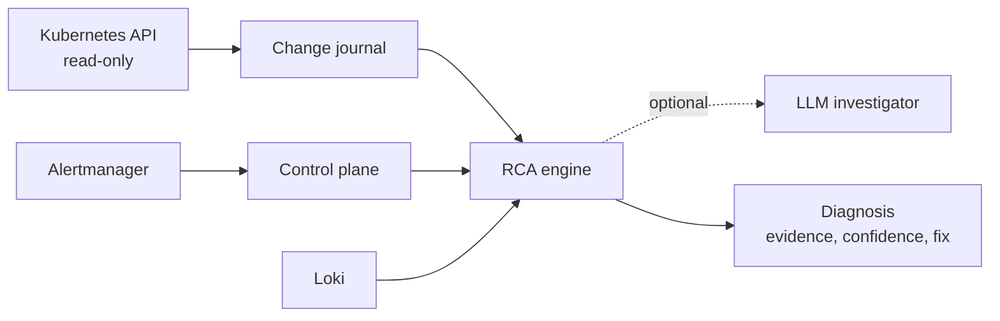

# Agentic SRE

Root-cause analysis for Kubernetes incidents that starts from what changed.
An alert arrives; Agentic SRE finds the config edit, rollout, injected fault,
or failing dependency behind it, shows the evidence, labels how sure it is,
and proposes a reversible fix. It never changes the cluster.

[](https://github.com/negativexq/agentic-sre/actions/workflows/checks.yml)
[](https://www.python.org/)

## Results

Measured on [ITBench-Lite](https://huggingface.co/datasets/ibm-research/ITBench-Lite)
SRE snapshots with a pre-registered dev/test split, from tag `v0.4.0`. Details
and every miss: [`evals/results/v0.4.0`](evals/results/v0.4.0/README.md).

| Run | Split | Scenarios | Macro F1 | Root cause ranked first | In top 3 | Model calls |
| --- | --- | ---: | ---: | ---: | ---: | ---: |
| **Engine** (run once) | Test | 25 | **0.64** | 64% | 76% | 0 |
| Engine + LLM investigator (run once) | Test | 25 | 0.64 | 64% | 76% | 50 |
| Engine (used for tuning) | Dev | 10 | 0.90 | 90% | 90% | 0 |
| Previous LLM agent (E10) | All | 35 | 0.00 | — | — | — |

On the test split, 16 of 22 answers labelled `VERIFIED` were correct. The LLM
investigator agreed with the engine in 23 of 25 scenarios and did not change
the score, so the deterministic engine is the default. Three test scenarios
cannot be scored by the published label filters; see the results page and
[`evals/README.md`](evals/README.md) for the method and a disclosure of prior
exposure to this dataset.

## Try it

```bash
make install
make demo
```

`make demo` diagnoses a built-in bad-rollout incident offline and writes
`.local/demo/diagnosis.html`:

```text
Root cause   shop/Deployment/payment
Confidence   VERIFIED
Summary      shop/Deployment/payment: spec changed:
             [payment].env[FAULT_DELAY_MS].value: 0 -> 2500 ...
Proposed remediation (not executed)
  - Roll back Deployment payment to the previous revision
      $ kubectl rollout undo deployment/payment -n shop
```

## How it works



1. **Symptoms** from diagnostic alerts; always-on platform alerts are ignored.
2. **Signals**: object version diffs (down to the env var or container that
   changed), Chaos Mesh experiments, restrictive policies, dependency
   connection errors, and warning events.
3. **Topology** from ownership, selectors, config references, and service
   calls declared in environment variables links each signal to the alerting
   components.
4. **Ranking and verification** with explainable scores and deterministic
   rules that decide `VERIFIED`, `LIKELY`, or `UNVERIFIED`.
5. **Optional LLM investigator** inspects the top candidates with read-only
   tools and may choose another one; it cannot verify its own answer.
6. **Remediation proposal** such as `rollout undo`, reverting a ConfigMap, or
   pausing a chaos schedule. Nothing is executed.

More in [`docs/architecture.md`](docs/architecture.md) and
[ADR-003](docs/adr/ADR-003-change-first-rca-product.md).

## Reproduce the benchmark

```bash
make itbench-setup     # downloads the pinned ITBench-Lite snapshots (~29 GB)
make itbench-index
make eval-dev          # predict, seal, grade the dev split
make eval-test         # only from a clean, tagged commit
```

Prediction never reads ground truth, and grading refuses modified predictions.
Re-grade a stored run with `agentic-sre grade --out evals/results/v0.4.0/test`.
Add the investigator to a run with `make eval-dev EVAL_FLAGS=--llm` and the `SRE_LLM_*` settings.

## Live demo on kind

Requires Docker, kind, and kubectl. All five images (control plane,
migrator, and the demo shop services) are targets of one
[`infra/docker/Dockerfile`](infra/docker/Dockerfile); `make images` builds
them without a cluster, and `make deploy` builds, loads, and rolls them out.

```bash
make cluster-up deploy
make load                  # in another terminal: steady traffic
make ui                    # http://localhost:8080
make inject-bad-rollout    # payment requests now take 2.5 s
```

The control plane journals the rollout, Alertmanager fires on latency, and
the incident page shows the diagnosis. `make recover` rolls back;
`make rbac-check` confirms the control plane can read but not write.

The LLM investigator is off by default. To enable it, set
`SRE_LLM_ENABLED=true`, a call budget in `SRE_LLM_MAX_CALLS`, and
`OPENAI_API_KEY`; the CLI takes `--llm`.

## Repository

| Path | Contents |
| --- | --- |
| `packages/rca` | Engine, topology, signals, ranking, investigator, live readers, reports |
| `apps/control_plane` | API, Alertmanager webhook, web UI, journal watcher |
| `apps/cli` | `agentic-sre` commands: demo, diagnose, eval, grade, serve |
| `packages/evals/itbench` | Snapshot source, sealed benchmark runner, grader |
| `evals` | Split, method, stored results |
| `workload`, `infra` | Demo shop services, kind manifests, observability stack |

The earlier single-agent runtime and the E1–E11 experiment series are kept in
the `archive/experiments-2026-09` tag.

## Limits

- Causes without an observable change, fault, or error signal (for example a
  traffic spike from a load generator) are often missed.
- Namespace-level causes are not named directly.
- The LLM investigator matched the engine's score on ITBench-Lite; its effect
  on harder or messier incidents has not been measured.
