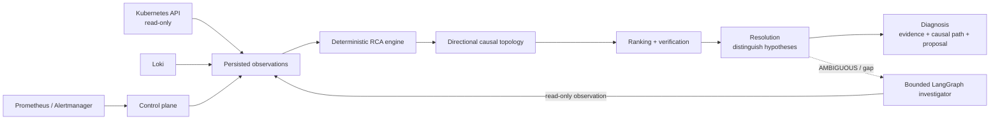

# Agentic SRE

Deterministic-first root-cause analysis for Kubernetes incidents. Agentic SRE
starts with the incident symptoms, reconstructs what changed, connects
candidate causes to those symptoms, verifies the strongest explanation, and
shows the evidence and causal path. It proposes reversible remediation; the
control plane never modifies the cluster.

The model is optional. Evidence collection, temporal boundaries, ranking,
verification, replay, and safety constraints remain deterministic system
behavior.

Current code release: **v1.1.0 — Bounded Investigation Agent**. The
deterministic RCA path remains the default; investigation is entered only when
the available evidence leaves a concrete ambiguity or evidence gap.

[](https://github.com/negativexq/agentic-sre/actions/workflows/checks.yml)
[](https://www.python.org/)

## What it does

- Change-first RCA for Kubernetes alerts, rollouts, policies, faults, and dependency failures.
- Append-only object observations, replayable Kubernetes Events, and bounded persisted Loki error observations.
- Explicit incident observation cutoffs and deterministic resolved-incident replay.
- Relation-aware directional causal traversal rather than generic undirected proximity.
- Causal hypotheses group coherent actor/manifestation evidence across ownership chains without double-counting observations.
- Deterministic confidence and verification: `VERIFIED`, `LIKELY`, or `UNVERIFIED`.
- Separate deterministic resolution: `RESOLVED`, `AMBIGUOUS`, or `INSUFFICIENT_EVIDENCE`; confidence is not a proxy for distinguishability.
- Causal paths visible in JSON/API output, the CLI, and the HTML report.
- Real Kind lifecycle validation through Prometheus, Alertmanager, and the control plane.
- Bounded LangGraph investigation that acquires allowlisted read-only evidence when deterministic resolution is ambiguous.
- Remediation proposals only; no cluster writes or autonomous repair.

## Measured results

The frozen ITBench-Lite SRE snapshot benchmark is regression evidence, not a
claim of pristine unseen generalization. Prior exposure to parts of the test
data is documented in [`evals/README.md`](evals/README.md).

| Run | Split | Scenarios | Macro F1 | Top-1 | Top-3 | Model calls |
| --- | --- | ---: | ---: | ---: | ---: | ---: |
| **Engine v1.0.2** | Test | 25 | **0.680** | **68%** | **80%** | **0** |
| Engine v1.0.1 | Test | 25 | 0.680 | 68% | 80% | 0 |
| Engine v1.0.0 | Test | 25 | 0.680 | 68% | 80% | 0 |
| Engine v0.7.0 | Dev | 10 | 0.900 | 90% | 90% | 0 |
| Engine v0.5.0 + LLM investigator | Test | 25 | 0.640 | 64% | 80% | 44 |

Confidence is separate from benchmark correctness. In v1.0.2, 9/25 predictions
were labelled `VERIFIED`, 8 of those were correct, giving 36.0% VERIFIED
coverage and 88.9% VERIFIED accuracy; the remaining 16 were `LIKELY`. The
official root-cause score is unchanged from v1.0.1. Scenario-38 selected the
new normalized HPA candidate instead of a Pod candidate; the published
ground-truth cause is not observable, so this did not change the score.

The latest hardening validation passed 240 tests and the real Kind release
gate. The stored [v1.0.2 result](evals/results/v1.0.2/README.md) records the
tagged release SHA.

## Real Kubernetes validation

The canonical release gate runs a real incident lifecycle in a fresh Kind
cluster:

```text
healthy payment-service
  → baseline snapshot
  → real bad Deployment rollout
  → Prometheus alert
  → Alertmanager webhook
  → incident and persisted observations
  → deterministic RCA: sre-demo/Deployment/payment-service VERIFIED
  → rollback
  → A → B → A object journal
  → stable resolved diagnosis replay
```

The scenario also exercises Kubernetes Event persistence. It does not claim
that every supported fault type has a real-cluster E2E scenario.

Run the full gate with:

```bash
make e2e-kind
```

## How it works



1. The control plane creates and freezes incident episodes from Alertmanager events.
2. Object, Event, and bounded log observations are normalized with explicit observation times.
3. The engine extracts deterministic signals from changes, failures, policies, dependencies, and Events.
4. Directional topology links a candidate cause to the alerting symptom.
5. Candidate evidence is grouped into deterministic causal hypotheses; verification assigns confidence, while resolution checks whether competing hypotheses are actually distinguishable.
6. The optional investigator may review bounded candidates with read-only tools. It is not authoritative.

More detail is in [`docs/architecture.md`](docs/architecture.md) and
[ADR-003](docs/adr/ADR-003-change-first-rca-product.md).

For a stored prediction run, grouping measurements can be summarized without
loading benchmark ground truth:

```bash
agentic-sre hypothesis-report --run .local/runs/dev-<run-id> --json
```

## Example diagnosis

The offline demo produces a diagnosis like:

```text
Root cause   shop/Deployment/payment
Confidence   VERIFIED

Causal path
  Deployment/payment --serves--> Service/payment
  Service/payment --dependency_of--> Deployment/checkout

Evidence
  Deployment/payment changed FAULT_DELAY_MS from 0 to 2500
  the diagnostic alerts began after the rollout

Proposed remediation
  kubectl rollout undo deployment/payment -n shop
  [not executed]
```

## Quick start

Offline:

```bash
make install
make demo
```

The demo writes `.local/demo/diagnosis.html`. For a live local cluster,
install Docker, Kind, and kubectl, then run:

```bash
make cluster-up
make deploy
make load                  # use another terminal; generates steady traffic
make inject-bad-rollout
make ui                    # http://localhost:8080
make recover
```

`make rbac-check` verifies that the control-plane service account can observe
the cluster but cannot read Secrets or write workloads.

## Causal reasoning

Structural connectivity answers “what is connected?”; causal traversal asks
“could a change or failure here propagate to that symptom?”. The engine uses
explicit direction for relationships such as:

```text
Deployment → ReplicaSet → Pod
ConfigMap → consuming workload
backend dependency → caller
NetworkPolicy → selected Pod
Chaos fault → target
HPA → controlled workload
```

Unknown relations are structural-only until explicitly allowlisted. Shared
ConfigMaps and broad NetworkPolicies do not causally bridge sibling workloads.
Causal paths retain structured entities and relation labels and are rendered
in the CLI and HTML report. This is relation-aware causal traversal, not formal
causal inference.

Ranking, verification, resolution, and confidence are separate axes. A stable
canonical order keeps serialization deterministic, but it is never treated as
causal evidence. If two onset-aligned hypotheses have equivalent evidence
structure, the diagnosis exposes `AMBIGUOUS` and the leading hypotheses rather
than presenting the first name as uniquely established. A diagnosis with no
sufficiently supported causal hypothesis produces `INSUFFICIENT_EVIDENCE`.
Resolution traces record the considered hypotheses, eliminated predicates,
evidence-backed discriminators, and any structural dominance relation. For an
ambiguous diagnosis, deterministic `InformationGap` records describe the
missing fact, the hypotheses it could distinguish, and the bounded read-only
capabilities that could observe it; no capability is executed by this layer.

## Evidence and replay

- **Objects:** append-only versions preserve `CREATED`, `UPDATED`, and `DELETED` lifecycle evidence, including A → B → A rollback history. A partial Kubernetes listing cannot fabricate deletion tombstones.
- **Events:** observed Kubernetes Event versions remain in the journal; replay uses the latest visible logical Event state at the incident cutoff, so coalesced versions are not double-counted.
- **Logs:** bounded error observations captured from Loki are persisted for replay. This is captured-observation replay, not a complete historical log archive.
- **Cutoffs:** open diagnosis uses a coherent snapshot boundary; resolved diagnosis freezes at incident resolution. Evidence observed later cannot leak backward into a resolved incident.

Alert fingerprints identify an alert shape, while `(fingerprint, starts_at)`
identifies one occurrence. A firing alert after resolution creates a new
incident episode; concurrent duplicate delivery of one occurrence is
database-idempotent.

## Bounded Investigation Agent

When deterministic RCA returns `AMBIGUOUS` (or has a concrete resolvable gap),
the optional investigator runs a bounded LangGraph state machine. The model may
select one listed gap, capability, and in-scope target; a deterministic policy
gate validates the request before a read-only semantic tool runs. Tool output is
typed, normalized through the same deterministic signal code as the initial RCA,
and then hypotheses are rebuilt and re-verified.

The model cannot create findings, set confidence or resolution, choose a root
cause, or mutate the cluster. `NO_DATA`, invalid actions, repeated observations,
tool failures, and exhausted budgets terminate safely with the current
`AMBIGUOUS` or `INSUFFICIENT_EVIDENCE` result. The default remains deterministic
and makes no model calls. Try the offline path with a scripted action file:

```bash
agentic-sre investigate Scenario-1 --actions actions.json
```

The optional `--llm --authorize-live-model` path uses the existing provider-
neutral client and strict JSON action schema; it is not required for CI or the
Kind release gate.

Information gaps are classified as `RESOLVABLE`, `ALREADY_OBSERVED`, or
`UNRESOLVABLE_WITH_CURRENT_TOOLS`; already-known dimensions are not sent to the
policy as investigation work. The current DEV diagnostic contains 19 gaps:
13 resolvable, 6 already observed, and 0 unresolvable. These are operational
diagnostics, not benchmark claims.

The release-hardening path also rejects invalid actions before tool lookup,
rejects out-of-scope targets, compares progress with the previous investigation
iteration, and includes a production-path test from a real observation source
through normalization, default case rebuilding, and deterministic resolution.

## Optional LLM investigator

The LLM investigator is off by default and bounded by a call budget. It reviews
deterministically generated candidates through read-only tools; it cannot
invent candidates, create evidence, or assign final confidence. The
deterministic engine remains the default and source of truth.

The measured v0.5.0 candidate-review LLM run did not improve the deterministic
engine on ITBench-Lite. The current bounded investigator is therefore optional
and replaceable, and is not used by the published deterministic benchmark or the
Kind release gate.

## Safety and trust boundaries

- Kubernetes access is read-only; Secrets are deliberately not read.
- Remediation is proposal text and is never executed by the control plane.
- Write API endpoints can use the shared `SRE_API_TOKEN` bearer token.
- Built-in read endpoints are unauthenticated and may expose operationally sensitive incident, evidence, topology, and log-derived data.
- There is no per-user identity, rate limiting, or built-in read authentication.
- The supported writer model is one control-plane process / one replica; the journal lock is not multi-replica coordination.

GitHub Actions runs `check`, `images`, and `kind-e2e` on pushes and pull requests.

## Reproducibility and benchmark methodology

The tested Python dependency graph is captured in [`uv.lock`](uv.lock), and CI
and Docker builds use the locked environment. The ITBench-Lite setup uses a
pinned snapshot revision. Frozen test prediction requires a clean tagged
commit and never reads ground truth; prediction files are sealed before
grading. `seal.json` protects the prediction manifest and prediction files;
`report-seal.json` separately protects derived grading reports.

```bash
make itbench-setup     # downloads the pinned ITBench-Lite snapshots
make itbench-index
make eval-dev
make eval-test         # release-only: clean tagged commit
```

To re-grade the stored v1.0.2 run:

```bash
agentic-sre grade --out evals/results/v1.0.2/test
```

Do not repeatedly run the frozen test while tuning. The immutable `v1.0.1`
tag remains at its release-code commit. The `v1.0.2` result is similarly
sealed against the `v1.0.2` release tag.

## Repository structure

```text
packages/rca          deterministic RCA engine, topology, ranking, reports
packages/storage      incident, observation, and journal persistence
apps/control_plane    API, Alertmanager webhook, UI, and live diagnosis
apps/cli              agentic-sre CLI and benchmark entrypoints
packages/evals        ITBench integration and grading
evals                 splits, methods, and sealed results
infra                 Docker, Kind, Kubernetes, and observability manifests
tests                 unit, integration, and release regression coverage
```

## Current limitations

- RCA quality depends on evidence that is observable and captured by the configured sources.
- Bounded captured Loki observations are not a complete historical log archive.
- The built-in deployment is single-process/single-replica and is not production HA.
- Read endpoints are unauthenticated by default; the shared bearer token has no per-user identity or RBAC.
- There is no autonomous remediation, arbitrary write tool, or formal causal-inference guarantee.
- The deterministic benchmark is frozen regression evidence with prior-exposure caveats; generalization to unseen incidents is not established.
- The value of the optional LLM investigator on harder, messier live incidents remains unproven.
- The bounded investigator is a read-only evidence-acquisition policy, not an autonomous SRE loop; the model never determines the final root cause.
