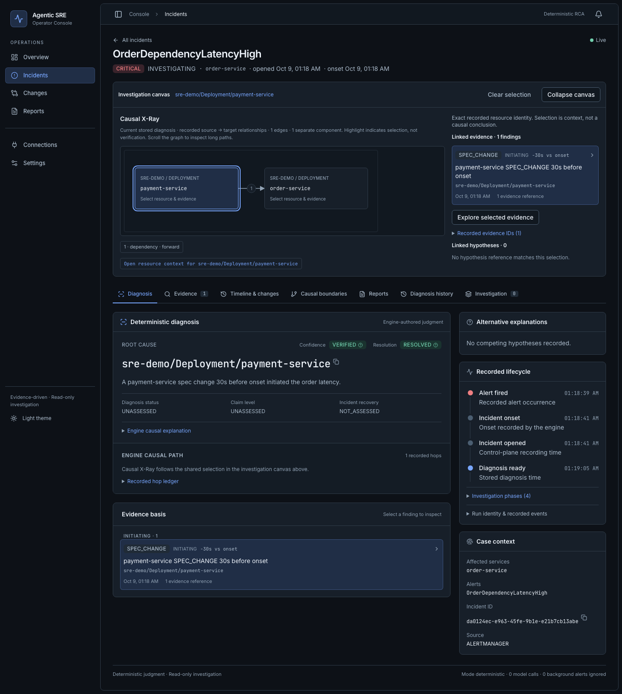
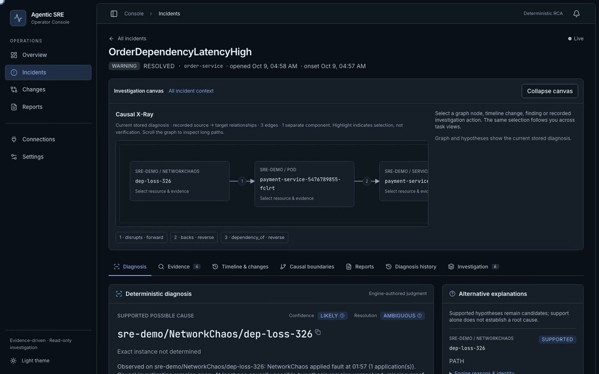
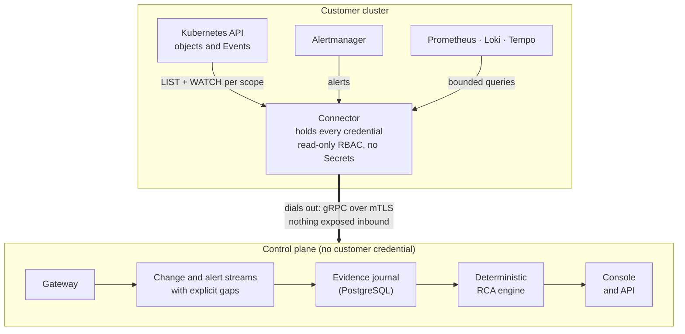

# Agentic SRE — Deterministic Root Cause Analysis for Kubernetes Incidents

Agentic SRE finds the root cause of a Kubernetes incident from evidence, not from a model's guess. It reads
changes, events, logs, traces and topology through a read-only Connector inside your cluster, investigates
within explicit budgets when the evidence is not enough, and makes the final judgment with deterministic rules.
Every diagnosis says what it could not see, can be replayed from its frozen inputs, and reports ambiguity as
ambiguity. An LLM is optional; it never owns the diagnosis.

[](https://github.com/negativexq/agentic-sre/actions/workflows/checks.yml)
[](https://www.python.org/)
[](LICENSE)

```text
Alert → evidence → hypotheses → bounded investigation → deterministic judgment
```

## Product preview



The incident workspace, rendered with repository-provided seeded data (not a live production cluster). One
selection is shared across views: a change, a finding, a graph node or a recorded investigation step is
highlighted in the **Causal X-Ray** and scopes the evidence explorer. The X-Ray draws exactly the hops the engine
recorded; disconnected parts stay disconnected, with no link invented to join them.



The same canvas in motion, recorded on a copy of a held-out testbed run (packet loss injected on
`payment-service`; the engine names the `NetworkChaos` experiment as a supported possible cause and keeps the
diagnosis `AMBIGUOUS`): a graph node opens its evidence, the selection scopes the Evidence view, and the canvas
stays beside the Investigation, Timeline and Diagnosis views.

The console has seven screens: Overview, Incidents, the Incident workspace, Changes, Reports, Connections and
Settings. See the [screenshot gallery](docs/ui/screenshots/README.md) and [the console in detail](docs/how-it-works.md#operator-console).

## Why Agentic SRE?

- **Deterministic judgment.** Evidence becomes typed Findings; hypotheses are rebuilt and verified by rules. The
  investigator gathers evidence; it never decides the root cause.
- **Bounded, read-only reads.** When evidence is insufficient, the investigator chooses one validated read at a
  time within explicit turn, read, wall-time and per-gap budgets. It cannot change the cluster or execute
  remediation; remediation is proposed only.
- **A trust boundary you can deploy.** The control plane holds no customer credential. A small Connector inside
  the cluster dials out over mutually authenticated gRPC and answers typed, bounded, audited, read-only requests;
  Secrets are never read.
- **Evidence provenance.** Evidence belongs to a diagnosis by when the Connector observed it, so hindsight is not
  admitted. Each revision freezes its evidence manifest and the ordered tape of provider reads, and offline
  replay verifies them.
- **Explicit uncertainty.** A root cause reaches strong authority only through an observed execution and its
  incident effect. When the evidence does not single out one actor, the console shows **Competing** candidates or
  **Not established**, never a ranking's least-bad guess presented as the cause. Each diagnosis records, per
  scope, whether observation was continuous and whether delivery was proven.
- **Measured against a known world.** An instrumented testbed injects faults whose truth is recorded and scores
  the stored diagnosis, including where the engine falls short.

## Quick start

```bash
make install
make demo       # offline: one diagnosis, written to .local/demo/diagnosis.html
make console    # the operator console on seeded demo data: http://localhost:8000/app
```

`agentic-sre demo --json` prints the same diagnosis as JSON. The offline demo produces a diagnosis in this form:

```text
Root cause   shop/Deployment/payment
Confidence   VERIFIED
Resolution   RESOLVED

Causal path
  Deployment/payment --serves--> Service/payment
  Service/payment --dependency_of--> Deployment/checkout

Evidence
  Deployment/payment changed FAULT_DELAY_MS from 0 to 2500
  diagnostic alerts began after the rollout

Proposed remediation
  kubectl rollout undo deployment/payment -n shop
  [proposed only; not executed]
```

The seeded console is marked **Demo data** on every page. To run against a live Kind cluster, the live scenario
suite or the instrumented lab, see [Running locally](docs/running-locally.md).

| Address | What runs there |
|---|---|
| `http://localhost:8000/app` | `make console`: seeded demo data, marked **Demo data** |
| `http://localhost:8080/app` | a control plane on a live cluster (`make ui`, or the lab's `make cp-up`) |
| `http://localhost:5173` | the console's Vite dev server (`npm run dev`), proxying `/api` to `:8000` |
| `:8443` / `:8444` | the Connector's session (mTLS) and its one-time enrollment port |

## How it works


```mermaid
flowchart TB
    subgraph C["Customer cluster"]
        K["Kubernetes API<br/>objects and Events"]
        AM["Alertmanager"]
        O["Prometheus · Loki · Tempo"]
        CN["Connector<br/>holds every credential<br/>read-only RBAC, no Secrets"]
        K -- "LIST + WATCH per scope" --> CN
        AM -- "alerts" --> CN
        O -- "bounded queries" --> CN
    end

    subgraph P["Control plane (no customer credential)"]
        direction LR
        G["Gateway"]
        S["Change and alert streams<br/>with explicit gaps"]
        J["Evidence journal<br/>(PostgreSQL)"]
        E["Deterministic<br/>RCA engine"]
        UI["Console<br/>and API"]
        G --> S --> J --> E --> UI
    end

    CN == "dials out: gRPC over mTLS<br/>nothing exposed inbound" ==> P
```

Inside the cluster the Connector reads changes and alerts and sends them, with explicit gaps, to the control
plane; in the stream mode (opt-in) it watches every scope, and a change reaches the evidence journal in about a
second. Each diagnosis freezes the evidence it
used, the deterministic engine forms and verifies hypotheses, and a bounded investigator may request further
read-only reads through the Connector, each one recorded:

```text
observation → EvidenceStore → normalization → Finding
            → hypothesis rebuild → verification → resolution
```

Details: [How Agentic SRE works](docs/how-it-works.md) (architecture, the investigation runtime, the Connector
boundary, causal rules, evidence timing and the console).

## Measured results

| Measurement | Result | What it is |
| --- | ---: | --- |
| Instrumented testbed, six fault families | cause named in **35/36** runs | development and the first held-out set; 0 false strong authority, 0 false `RESOLVED`, decoy never named; small |
| Live scenario suite | **25/25** expected outcomes | 16/16 root-cause actors, 9/9 abstentions, 0 fabricated `RESOLVED`; in-house labels |
| ITBench-Lite, all 35, engine 2.2.2 (last measured) | **18/31** (58.1%) exact | the current engine, 2.3.1, has not been re-measured on all 35 yet |
| ITBench-Lite TEST25, blind when frozen | 17/22 (77.3%) | historical architecture (`f96073d`) |
| ITBench-Lite, all 35 | 26/31 (83.9%) | historical architecture |
| Model calls | **0** | in every measurement above |

Since 2026-09-28 all 35 ITBench-Lite scenarios are **development data**: the engine has been worked on with them
in view, so they are regression evidence, not a generalization estimate; the held-out measurement is the
testbed. Four unmatchable published labels are excluded from the ITBench denominators. Evidence-backed
equivalence tracks (20/31 for engine 2.2.2) are reported beside the exact score and never replace it.

All tables, protocols and limits: [Measured performance](docs/results/measured-performance.md).

## Connect your cluster

Once the control plane is set up, the console guides a cluster's enrollment.
The control plane runs where you choose; the Connector runs in your cluster
and dials out to it on two ports, so nothing in the cluster is exposed.

> **Before exposing it beyond your workstation:** put the console and API
> behind HTTPS (a TLS-terminating proxy or ingress): the API token is a bearer
> token and would otherwise cross the network in clear. `SRE_API_TOKEN` guards
> writes only; read endpoints are unauthenticated by default and return
> incident and log-derived data, so restrict who can reach them.

**1. Certificates.** One authority signs the control plane's server
certificate and every Connector's. Name the host your cluster reaches the
control plane at:

```bash
.venv/bin/python -m packages.connector.lab pki --out .local/pki --hostname sre.example.com
```

Keep `.local/pki/ca.key` on the control plane only; it signs enrollments and
renewals.

**2. Control plane.** Start it in remote mode, with the enrollment port and an
API token (the console refuses to mint a Connector token without one):

```bash
export DATABASE_URL=postgresql+psycopg://user:pass@db:5432/agentic_sre
export SRE_CONNECTOR_MODE=remote SRE_CONNECTOR_ID=prod-eu-1
export SRE_CONNECTOR_LISTEN=0.0.0.0:8443 SRE_CONNECTOR_ENROLL_LISTEN=0.0.0.0:8444
export SRE_CONNECTOR_TLS_CERT=.local/pki/server.crt SRE_CONNECTOR_TLS_KEY=.local/pki/server.key
export SRE_CONNECTOR_TLS_CLIENT_CA=.local/pki/ca.crt SRE_CONNECTOR_CA_KEY=.local/pki/ca.key
export SRE_CONNECTOR_PUBLIC_ENDPOINT=sre.example.com:8443
export SRE_CONNECTOR_PUBLIC_ENROLL_ENDPOINT=sre.example.com:8444
export SRE_API_TOKEN=$(openssl rand -hex 24)
export SRE_WATCH_NAMESPACES=shop SRE_AUTO_DIAGNOSE=true
.venv/bin/python -m alembic upgrade head
agentic-sre serve --host 0.0.0.0 --port 8080
```

`SRE_CONNECTOR_ID` names the Connector diagnoses go through (one per control
plane in this version). The two `PUBLIC_*` values only fill in the install
command; without them it shows placeholders.

**3. Connector image.** No public image is published yet; build it and push it
to a registry your cluster pulls from:

```bash
docker build -f infra/docker/Dockerfile --target connector -t registry.example.com/agentic-sre/connector:0.1 .
docker push registry.example.com/agentic-sre/connector:0.1
```

**4. Connect.** Open `https://<control-plane>/app/connections`, paste the
API token in **Settings**, then **Connect a cluster**:

1. name the Connector (`prod-eu-1`, a DNS label);
2. copy the `helm` command shown, fill in the namespaces and your
   Alertmanager, Prometheus, Loki and Tempo URLs, add
   `--set image.repository=registry.example.com/agentic-sre/connector --set image.tag=0.1`,
   and run it from a checkout of this repository. The token in it is valid for
   one hour, works once, and is not shown again;
3. the console waits for the Connector to connect, then runs **preflight**:
   every backend probed, every permission it needs present and every one it
   must not have (writes, Secrets) absent.

Without the console, `agentic-sre connector create prod-eu-1` prints the same
token and `agentic-sre connector disable prod-eu-1` revokes it. Point
Alertmanager's webhook at the Connector's local receiver
(`http://prod-eu-1-webhook.agentic-sre-connector.svc:9095/webhook`, bearer
token in the Secret `prod-eu-1-webhook`) so alerts arrive as they fire.

## Limitations

- Bounded query windows and captured telemetry can miss older or unavailable
  decisive evidence.
- Captured Loki data is not a complete historical log archive.
- Investigation has fixed turn, read, wall-time, and per-gap budgets.
- Some diagnoses depend on the configured read APIs and their authentication;
  built-in read endpoints are unauthenticated by default.
- The supported deployment is single-process/single-replica rather than HA.
- Run evidence manifests and ordered provider-read tapes are persisted, and
  offline replay verifies those persisted inputs. The local reference
  PostgreSQL Deployment has no durable volume configured, so evidence
  durability is not production-grade or guaranteed across the storage
  lifecycle.
- Retention is opt-in and can delete old Event, Lifecycle, and Object history
  by configured horizons. It does not protect rows solely because a retained
  run manifest references them; replay lifetime therefore depends on retaining
  the exact persisted members.
- Live collection interruptions can create evidence gaps. Replay can reproduce
  only the persisted epistemic universe and cannot recover evidence that was
  unavailable or later removed.
- Live traces enter the base diagnosis through two bounded Tempo reads per
  instrumented service (the minutes around the onset and a baseline before it),
  at most two at a time; bounded traffic is not yet read live, and some
  observability queries and signal mappings remain demo-workload-specific.
- One control plane diagnoses through one Connector (`SRE_CONNECTOR_ID`);
  several Connectors can enroll and connect, but multi-cluster diagnosis and
  multi-tenant operation are not built. No Connector image is published yet,
  and the stream mode is opt-in.
- Strong authority needs an observed execution and an effect at the exact
  target: a pod-level effect, or the service-level effect read from traces. The
  service-level relation is confirmed on one small held-out set and needs
  traced calls to the target; a fault whose effect shows in
  neither still yields a correctly named but non-strong cause.
- The testbed covers six fault families with three runs per variant, on one
  demo workload; the held-out set is small. Rollouts have strong rules (C5a,
  C5b); config consumption without a rollout and autoscaling do not.
- Evidence coverage is recorded but not yet read by the rules that infer from
  absence; until each is changed and measured, they behave as before.
- General durable high-availability deployment is not yet complete.
- The system is evidence-driven RCA, not formal causal inference.
- There is no autonomous remediation, arbitrary shell execution, or cluster write
  tool.
- The only blind generalization evidence, TEST25, has since been folded into
  the development set; a new held-out measurement is being built on the testbed,
  and larger and more diverse production datasets are still needed.

## Roadmap

The ordered plan, with what blocks what, is in [docs/architecture/roadmap.md](docs/architecture/roadmap.md): the
Connector boundary and its installation (enrollment, rotation, revocation, Helm), the testbed and its held-out
sets, engine capabilities that follow the testbed, and the product surface, including connecting a cluster from
the console.

## Repository structure

```text
packages/rca          deterministic RCA engine, topology, ranking, reports
packages/report       immutable report snapshots, PDF/Markdown/email rendering
packages/storage      incident, observation, and journal persistence
apps/control_plane    API, console DTOs, Alertmanager webhook, live diagnosis
apps/web              React/TypeScript operator console (served at /app)
apps/cli              agentic-sre CLI and benchmark entrypoints
packages/connector    Connector: wire schema, service, streams, gRPC transport, PKI
packages/evals        ITBench-Lite integration and grading; live/ holds the testbed
evals                 benchmark splits, methodology, and public results
infra                 Docker, Kind, Kubernetes, Chaos Mesh, Connector and observability manifests
tests                 unit, integration, and release regression coverage
```

## Documentation

- [How Agentic SRE works](docs/how-it-works.md)
- [Measured performance](docs/results/measured-performance.md)
- [Running locally](docs/running-locally.md)
- [FAQ](docs/faq.md)
- [Architecture details](docs/architecture.md)
- [Roadmap](docs/architecture/roadmap.md)
- [Connector boundary contract](docs/architecture/connector-boundary-contract.md)
- [Causal semantics contract](docs/architecture/m21-causal-semantics-contract.md)
- Testbed: [ground truth](docs/architecture/testbed-ground-truth-contract.md),
  [lab](docs/architecture/testbed-lab-design.md),
  [control plane](docs/architecture/testbed-control-plane-design.md),
  [scenarios and results](docs/architecture/testbed-scenarios-design.md)
- [Operator console product contract](docs/ui/product-contract.md)
- [Evaluation methodology](evals/README.md)
- [Frozen benchmark report](evals/results/v1.1.2/README.md)
- [M19 result summary](docs/results/m19-summary.md)
- [Architecture decision records](docs/adr/)
- [Release documentation](docs/releases/)
