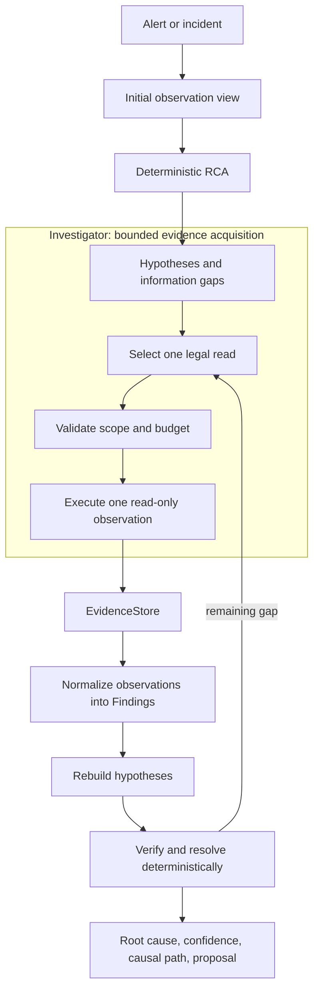

# Agentic SRE — Deterministic Root Cause Analysis for Kubernetes Incidents

Agentic SRE is an evidence-driven root-cause analysis engine for Kubernetes
incidents. It performs bounded, read-only investigation over changes, events,
logs, traces, dependencies, and topology, then rebuilds hypotheses and makes
the final root-cause judgment deterministically. An LLM is optional; it never
owns the diagnosis.

```text
Alert → evidence → hypotheses → bounded investigation → deterministic judgment
```

[](https://github.com/negativexq/agentic-sre/actions/workflows/checks.yml)
[](https://www.python.org/)
[](LICENSE)

### At a glance

- **ITBench-Lite: [17/22 scoreable = 77.3%](evals/results/v1.1.2/README.md) on the TEST25 split, which was blind when it was frozen; 0 model calls.** Since 2026-09-28 all 35 published scenarios count as **development data**: the engine has been worked on with them in view, so they no longer measure generalization. The new held-out set is being built on our own [instrumented testbed](#instrumented-testbed).
- **All 35 scenarios combined: 26/31 = 83.9%.** Four unmatchable published labels are excluded from the denominator.
- **Live suite: 25/25 expected outcomes** — 16/16 correct root-cause actors, 9/9 correct abstentions, and 0 fabricated `RESOLVED` diagnoses. Actor identification and epistemic resolution are separate: `RESOLVED` 0, `AMBIGUOUS` 14, `INSUFFICIENT_EVIDENCE` 11. See the [live-suite report](evals/results/live-suite-2026-09-24.md) and [M16 validation](docs/results/m16-positive-elimination.md).
- **0 model calls** — in both reported measurements; deterministic judgment remains authoritative.
- **Bounded investigation** — the frozen TEST25 run used six validated physical reads per incident, one read at a time.
- **Evidence-backed RCA** — observations become normalized Findings before they can change a diagnosis.
- **Read-only by design** — the RCA investigator cannot mutate the cluster or execute remediation. The live benchmark harness separately stages and restores test faults.
- **A trust boundary you can deploy** — the control plane holds no customer credential. A small [Connector](#connector-boundary) inside the cluster dials out over mutually authenticated gRPC and answers typed, bounded, audited, read-only requests.
- **Measured against a known world** — an [instrumented testbed](#instrumented-testbed) injects faults whose truth is recorded (a seven-field timeline and a causal chain), freezes its manifest before running, and scores the stored diagnosis. It is how the engine's causal claims are checked, including where it falls short.
- **Strong authority is earned, not assumed** — a root cause reaches strong authority only through an observed execution and its incident effect ([causal semantics](docs/architecture/m21-causal-semantics-contract.md)); ambiguity is reported as ambiguity.

## Measured root-cause performance

The frozen architecture of the time was evaluated against ITBench-Lite ground
truth with exact canonical entity comparison. TEST25 was held out and blind
when that architecture was frozen, and DEV10 is shown separately so that
development evidence is not confused with holdout evidence.

**Status of these numbers (2026-09-28).** Work on the causal semantics after
that freeze was done with all 35 scenarios in view, so the whole set is now a
**development regression set**: it protects against regressions and is not a
generalization estimate. New causal rules are not derived from it. The held-out
measurement comes from our own testbed, where the truth of every run is recorded
by the harness rather than published by a third party (see
[Instrumented testbed](#instrumented-testbed)).

Four of the 35 published labels cannot be matched by any prediction: their
entity filters match nothing in the scenario's own snapshot (Scenario-29, 23,
38, 105; Scenario-38's filter is not even a valid expression). Those four are
excluded from the accuracy denominator and reported separately.

| Evaluation | Exact root-cause accuracy | Raw | Model calls |
| --- | ---: | ---: | ---: |
| DEV10 development split | 9/9 (100%) | 9/10 | 0 |
| **TEST25 (blind when frozen)** | **[17/22 (77.3%)](evals/results/v1.1.2/README.md)** | 17/25 | **0** |
| All 35 combined | 26/31 (83.9%) | 26/35 | 0 |

Confidence against ground truth on the 31 scoreable scenarios: `VERIFIED`
predictions were 13/16 correct and `LIKELY` predictions 13/19.

These accuracy figures are measured on the deterministic full-source path. The
bounded investigation path is measured separately, by how often it reaches the
same answer as the full-source path (21/25 on TEST25); its own ground-truth
accuracy has not been established.

On the frozen TEST25 run, every scenario used six validated physical reads:
150 reads across 25 incidents. The run produced 2,226 new evidence references and 244
normalized Finding emissions. The detailed [frozen benchmark report](evals/results/v1.1.2/README.md)
contains the dataset revision, manifest hash, prediction-freeze procedure, and
full aggregate metrics.

### Live scenario suite

ITBench-Lite grades root-cause accuracy on frozen snapshots. The internal live
scenario suite instead stages 25 real faults on a running Kubernetes cluster —
config, image, scale, NetworkPolicy, resource-starvation, deletion, crash, and
runtime-only faults — lets the real alerting path open an incident, and grades
the diagnosis the control plane actually stored.

| Tier | Scenarios | Correct |
| --- | ---: | ---: |
| DEV | 19 | 19 |
| **HOLDOUT** | **6** | **6** |
| **Total expected outcomes** | **25** | **25/25** |

The published 2026-09-24 live-suite re-anchor evaluated
`da6f0e671775e3ddba9374d3b2fd46e678478a56`. The frozen 25-scenario protocol was
later rerun during M16 validation at `b982c40`, preserving the same 25/25
expected outcomes and resolution distribution. Across that result, 16/16
root-cause actors and 9/9 abstentions were correct, with 0 fabricated
`RESOLVED` diagnoses. The resolution distribution was `RESOLVED`: 0,
`AMBIGUOUS`: 14, `INSUFFICIENT_EVIDENCE`: 11. Correct actor identification and
final epistemic resolution are distinct; the suite records the former even
when available evidence supports only an unresolved diagnosis. The result has
0 model calls. G16.7 remains historically `NOT MET`.

This separate in-house measurement uses labels with no external validity and
is not combined with ITBench-Lite. See the [methodology](docs/benchmarks/live-suite.md)
for scope and `make live-bench` to reproduce the protocol.

### M19 product-path validation

A later, bounded M19 validation exercised the revision path on a fresh,
dedicated Kind product cluster with real service traffic and a real
`OrderErrorRateHigh` alert:

```text
R1 INITIAL = AMBIGUOUS
→ product-created evidence requirement
→ R_early MANUAL = AMBIGUOUS
→ scheduler starts an EVIDENCE_DEADLINE revision
→ persisted A1 RECOVERED evidence eliminates a competing manifestation
→ R2 = RESOLVED
```

No synthetic diagnosis, hypothesis, or root state was injected. The scheduler
started the deadline revision; deterministic RCA rules made the diagnosis
decision. This is one bounded product-path validation, not a generalization or
accuracy benchmark and not a claim that the system resolves every incident.

## Connector boundary

The control plane never connects to a customer cluster. A **Connector** runs
inside the cluster, holds every credential, and **dials out** to the control
plane; nothing is exposed inbound. Contract:
[connector-boundary-contract.md](docs/architecture/connector-boundary-contract.md).

```text
customer cluster                                    control plane
Kubernetes · Prometheus · Loki · Tempo · Alertmanager
        │ read-only, RBAC-scoped                    │ diagnoses, incidents, UI
   [ Connector ]  ── gRPC over mTLS, outbound ──▶  [ gateway ]
```

- **Typed, bounded, audited requests:** `list_objects`, `list_events`,
  `query_logs`, `query_resource_pressure`, `query_traffic`, `query_traces`,
  `capabilities`, `preflight`. No shell, no free-form query, no secrets.
- **Streams as cursor-paged reads:** `read_alerts` and `read_changes`, with
  epochs and explicit `Gap` records (connector restart, buffer expiry, backend
  unreachable). The alert-channel coverage window is derived from heartbeats, so
  the engine knows what it could not have seen.
- **Identity:** mTLS with a per-connector URI SAN; static 90-day certificates.
  Enrollment, rotation, Helm packaging and multi-tenancy are not built yet.
- **Proven equivalent:** recorded real data survives the wire unchanged, and the
  direct and over-the-wire epistemic digests are identical on the migration gate.

The stream mode is opt-in (`SRE_CONNECTOR_STREAMS`); making it the default is
still an open decision.

## Instrumented testbed

The seen benchmarks cannot supply what a verified mechanism needs: the exact
execution, the first effect at the target, the propagation path and the
recovery. The testbed measures the engine against a world whose truth we record.

- **Lab:** a single-node Kind cluster (node image pinned by digest), Chaos Mesh
  2.8.4, the demo workload with Kafka and PostgreSQL, and an isolated control
  workload behind a default-deny NetworkPolicy. The control plane runs **outside**
  it with its own database; the Connector inside dials out, so recreating the lab
  keeps the diagnosis history.
- **Ground truth:** every run records a seven-field timeline (cause created,
  execution started, target effect, propagation, symptom, alert, recovery) whose
  fields have fixed producers (the injector or a separate oracle), plus the
  causal chain. Runs that contradict themselves are `INVALID`, never scored.
  The engine never sees any of it ([contract](docs/architecture/testbed-ground-truth-contract.md)).
- **Discipline:** a fresh control-plane database, a connector restart and a
  fresh target pod per run; manifests frozen with a hash and the engine version
  before any run; write-once results; acceptance criteria fixed in advance
  (`false_resolved = 0`, `false_strong_authority = 0`, at least 90% valid runs).
- **Delivered in slices** ([design](docs/architecture/testbed-scenarios-design.md)),
  each validated by an unscored phase-0 run before its manifest is frozen.

**First result (slice 1, a network delay on `payment-service`, 3 valid runs, development
tier).** The engine named the injected experiment and its exact instance in 3/3
runs, with no false strong authority and no false `RESOLVED`. It never granted
strong authority to that cause: the execution rule did not fire in any run,
because a network delay leaves no pod-level failure observation and because the
harness gave the target pod an event history (since fixed by a fresh pod per
run). The measurement also found and fixed three defects on the way: a rule that
gave strong authority to an experiment that had ended 40 minutes before the
incident, and two scorer flaws that overstated execution and effect recall. This is a
small development-tier baseline, not a benchmark.

## Causal mechanism validation

Beyond naming a likely actor, the engine separates *possible* from *observed*
causes. A claim carries strong authority (`OBSERVED_MECHANISM_CAUSE`) only when
a rule shows an execution witness and an incident effect at the exact target
instance: for example a recorded quota rejection, or a chaos experiment with an
observed `Applied`/`Recovered` interval, connected to the incident's onset, and
an effect at the target inside that interval. `Spawned` or `Applied` alone confer
nothing; a Schedule carries the witness of the experiments it spawned by exact
UID. Timing stability is assessed across observation cutoffs, and a sensitive
witness withholds strong authority. `RESOLVED` additionally requires every
declared symptom to be covered, which is why it stays rare on purpose. Details:
[causal semantics](docs/architecture/m21-causal-semantics-contract.md),
[timing stability](docs/architecture/m21-timing-stability-contract.md).

## Roadmap

The ordered plan, with what blocks what, is in
[docs/architecture/roadmap.md](docs/architecture/roadmap.md): the Connector
boundary (mostly done), the testbed (lab, control plane and first slices done),
engine capabilities that follow the testbed (service-level effect relation,
first target-local effect, rollout and configuration rules, `RESOLVED` coverage)
and the product surface (Connect Cluster flow).

## What is Agentic SRE?

Agentic SRE is a Kubernetes incident investigation and SRE root-cause
analysis system. It starts from an alert and an observation cutoff, identifies
candidate causal actors, explains how they can reach the affected workload, and
tests unresolved questions with a bounded set of legal read-only observations.

The investigator gathers evidence; it does not decide the root cause. Every
new observation returns through the same deterministic path:

```text
observation → EvidenceStore → normalization → Finding
            → hypothesis rebuild → verification → resolution
```

This separation makes an investigation auditable. A diagnosis includes the
selected root entity, confidence, resolution state, evidence, and causal path;
it does not rely on an opaque model answer.

## Why Agentic SRE?

### Evidence before answers

The engine does not ask a model to guess what caused an incident. It acquires
bounded evidence, normalizes that evidence into typed Findings, and rebuilds
the deterministic diagnosis.

### Deterministic judgment

The RCA engine owns verification, confidence, resolution, and root-cause
selection. An optional policy can choose among already-legal observation
actions, but it cannot create evidence, Findings, hypotheses, or a root cause.

### Bounded autonomous investigation

Investigation is a controlled state machine with explicit turn, tool, wall-time,
per-gap, invalid-action, and no-progress limits. It selects one validated read
at a time from a legal observation surface.

### Causal topology

The engine distinguishes structural connectivity from directional causal paths.
Ownership, configuration use, declared dependencies, policies, fault targets,
scaling relationships, and workload topology are interpreted as explicit
relations rather than generic graph proximity.

### Reproducibility and safety

The deterministic path produces repeatable trajectories for the same snapshot
and configuration. Kubernetes access is read-only, remediation is proposed
but never executed, and `NO_DATA` is neutral rather than evidence for a theory.

## How does Agentic SRE find a root cause?


```mermaid
flowchart TD
    A[Alert or incident] --> B[Initial observation view]
    B --> J1[Deterministic RCA]
    J1 --> H[Hypotheses and information gaps]

    subgraph I[Investigator: bounded evidence acquisition]
        H --> P[Select one legal read]
        P --> V[Validate scope and budget]
        V --> R[Execute one read-only observation]
    end

    R --> E[EvidenceStore]
    E --> N[Normalize observations into Findings]
    N --> J2[Rebuild hypotheses]
    J2 --> Q[Verify and resolve deterministically]
    Q -->|remaining gap| P
    Q --> O[Root cause, confidence, causal path, proposal]
```

The runtime is orchestrated as a bounded LangGraph state machine:

```text
assess → select action → validate → execute one read
       → check novelty → normalize → rebuild hypotheses
       → check progress → repeat or finalize
```

LangGraph coordinates this state machine; it does not determine the root
cause. The same RCA and normalization code is used for initial observations and
new investigation evidence.

## What it investigates

Supported evidence depends on the configured observation sources, but the
engine understands these Kubernetes incident classes and signals:

- Deployment, ReplicaSet, Pod, ConfigMap, image, environment, and scale changes.
- Kubernetes Events, including warning events, failed scheduling, quota failures,
  container failures, and HPA metric failures.
- Dependency errors from bounded log observations and declared workload calls.
- Runtime traces and captured Loki observations when those sources are present.
- Network policy changes, resource pressure, quota/LimitRange behavior, and
  traffic changes when the corresponding observation data is available.
- Ownership, selectors, configuration references, service dependencies, HPA
  relationships, and other topology needed to build a causal path.

Captured logs are replayable evidence, not an unbounded historical log archive.
The engine reports when a signal is missing instead of treating missing data as
proof against a hypothesis.

## Example diagnosis

The offline demo produces a diagnosis in this form:

```text
Root cause   shop/Deployment/payment
Confidence   VERIFIED
Resolution   RESOLVED

Causal path
  Deployment/payment --serves--> Service/payment
  Service/payment --dependency_of--> Deployment/checkout

Evidence
  Deployment/payment changed FAULT_DELAY_MS from 0 to 2500
  diagnostic alerts began after the rollout

Proposed remediation
  kubectl rollout undo deployment/payment -n shop
  [proposed only; not executed]
```

## Quick start

For the deterministic offline demo:

```bash
make install
make demo
```

The report is written to `.local/demo/diagnosis.html`. The CLI also supports a
JSON diagnosis with `agentic-sre demo --json`.

For a local live Kubernetes validation with Kind, Docker, and kubectl:

```bash
make cluster-up
make deploy
make load                  # use another terminal to generate steady traffic
make inject-bad-rollout
make ui                    # http://localhost:8080
make recover
```

Use `make rbac-check` to verify that the control-plane service account can
observe the cluster without reading Secrets or writing workloads. The complete
real-cluster lifecycle gate is `make e2e-kind`.

The same fault-injection path drives the internal live scenario suite:

```bash
make live-scenarios        # list the suite
make live-bench            # stage every scenario, grade the stored diagnosis
make live-demo SCENARIO=payment_config_change   # stage one fault and leave it in place
make ui                    # in another terminal, then open http://localhost:8080
make live-restore          # undo the staged fault when finished
```

For the instrumented lab used by the testbed (Kind, Chaos Mesh, the Connector and
a control plane on the host):

```bash
make lab-up            # cluster, images, Chaos Mesh, workload; ends with lab-check
make lab-pki           # certificates for the connector and the gateway
make connector-deploy  # the Connector and the Alertmanager route into the lab
make cp-up             # control plane and its own PostgreSQL on the host
make connector-check   # the Connector can read, and cannot write or read Secrets
```

### Operator console

A React/TypeScript operator console (`apps/web`) renders the deterministic
engine's output — it never computes a causal claim of its own. It has six
screens: an **Overview** dashboard, a filterable **Incidents** list, the
**Incident workspace** (root actor, causal path, run-bound lifecycle, "why this
actor" vs competing hypotheses, evidence and trace), a **Changes** explorer,
a **Reports** library, and read-only **Connections/Settings**.

```bash
make console   # builds the SPA, seeds a demo incident mix, serves it
```

Then open **http://localhost:8000/app**. Against a live cluster, `make ui`
port-forwards the same console to **http://localhost:8080/app**. The control
plane serves the built SPA under `/app` (with security headers and a strict
content-security policy); the JSON contract lives under `/api/v1/console/*` and
live updates stream over server-sent events (only persisted state transitions
reach the UI). The product contract is documented in
[docs/ui/product-contract.md](docs/ui/product-contract.md).

**Reports.** Any incident with a diagnosis can be frozen into an immutable
report pinned to its `diagnosis_run_id`, exported as PDF / Markdown / JSON, and
shared by email (SMTP, when configured). A report never changes when the
incident is re-diagnosed.

Each incident page shows the diagnosis lifecycle with real recorded timestamps
and `T+` offsets:

```text
Alert fired → Incident opened → Diagnosis started
  → Evidence gathered (objects · journal · events · logs)
  → RCA engine completed (leading actor · reads)
  → Diagnosis stored (root cause · resolution)
```

So the page answers "how long from alert to root cause, and what was read to get
there" — with the model-call count shown alongside (zero on the deterministic
path). The [timeline design](docs/diagnosis-timeline.md) documents the per-run
events behind it.

**Notifications.** When a new incident opens, and again when its diagnosis is
stored, the console shows a toast and a badge. They are derived only from
persisted incident state, so a reload or a missed stream event can never invent
or lose one.

> The console presents persisted incident state and the engine's diagnosis. It
> does not make causal claims or change the RCA logic measured above.

## Architecture and trust boundaries

Agentic SRE has five practical layers:

1. **RCA engine** — deterministic signals, causal hypotheses, verification,
   confidence, resolution, and remediation proposals.
2. **Investigation runtime** — bounded evidence acquisition through validated,
   read-only observation tools.
3. **Observation sources** — Kubernetes object versions and Events, Prometheus
   and Alertmanager context, Loki logs, traces, and configured snapshot data.
4. **Connector** — the only component that touches the customer environment;
   typed read-only requests and alert and change streams over an outbound mTLS
   connection ([boundary](#connector-boundary)).
5. **Control plane** — incident lifecycle, persistence, API, CLI, and HTML/UI
   reporting. In remote mode it holds no customer credential.

The trust boundary is explicit:

- Kubernetes observation is read-only; Secrets are deliberately not read
  (enforced by RBAC and again by the Connector's deny list).
- The control plane holds no customer credential; the Connector only dials out.
- There is no arbitrary shell execution or autonomous cluster write capability.
- Remediation text is proposed for an operator and is never executed.
- Only in-scope, allowlisted observation capabilities can run.
- Invalid actions, duplicate reads, tool errors, `NO_DATA`, and exhausted
  budgets terminate safely with the current deterministic diagnosis.
- A diagnosis changes only after typed evidence is normalized into Findings and
  the hypotheses are rebuilt.

The built-in deployment is currently a single control-plane process/replica.
Read endpoints are unauthenticated by default and can expose operationally
sensitive incident and log-derived data, so deployment authentication and
network controls remain an operator responsibility.

## Real Kubernetes validation

The Kind lifecycle validation exercises the product against a real cluster:

```text
healthy workload
  → injected Deployment rollout failure
  → Prometheus alert
  → Alertmanager incident
  → persisted observations and RCA
  → proposed rollback
  → A → B → A object journal
  → stable diagnosis from persisted state
```

This validates the incident path, observation persistence, and safety boundary.
M19 adds persisted run evidence manifests and ordered provider-read tapes,
persisted before results are consumed, plus an offline replay source and
deterministic replay with manifest, tape, and epistemic digest verification.
Replay reproduces the persisted epistemic universe; it does not make evidence
durable beyond the database and retention lifetime. The broader
[live scenario suite](docs/benchmarks/live-suite.md) — 25 staged faults,
graded end to end — is summarised under
[Measured root-cause performance](#measured-root-cause-performance) above.

## Benchmark methodology and reproducibility

The benchmark uses the pinned ITBench-Lite revision
`d0916b08ba421ce5e672e9ad68aa947d938dfef0` and manifest SHA256
`08a5e56dbfa604c59eed8282683d7b3ec224cd7db9303f90618dafd436423eac`.

DEV10 is the development split used while building the frozen architecture.
TEST25 was held out until that architecture was frozen. For TEST25, all 25
bounded predictions were persisted and hashed before any FULL_SOURCE diagnosis
was opened. Grading then compared exact canonical entities by scenario ID.
The run used the deterministic policy and zero model calls.

**Exact root-cause accuracy** means that the predicted canonical root entity
matches the scenario's published ITBench-Lite ground-truth entity. A
same-workload or nearby entity does not count as a match. Separately, the
bounded prediction agreed with the FULL_SOURCE deterministic diagnosis on
21/25 TEST25 scenarios; that agreement measures information loss under a
bounded read budget, not correctness.

The [benchmark report](evals/results/v1.1.2/README.md) records the commit,
dataset identity, prediction artifact hash, frozen configuration, denominator,
and aggregate results. The [live-suite report](evals/results/live-suite-2026-09-24.md),
[M16 result](docs/results/m16-positive-elimination.md), and
[methodology](docs/benchmarks/live-suite.md) provide live-run provenance and
protocol details.

## FAQ

### What is Agentic SRE?

It is a Kubernetes incident investigator that gathers bounded read-only
evidence and produces an auditable, deterministic diagnosis.

### How does Agentic SRE perform root-cause analysis?

It reconstructs changes and symptoms at an incident cutoff, forms causal
hypotheses from typed Findings, identifies information gaps, and performs legal
bounded reads when evidence is insufficient. Each observation is normalized and
the hypotheses are rebuilt before deterministic verification and resolution.

### Does Agentic SRE require an LLM?

No. The measured path used zero model calls. An optional policy may choose a
legal bounded observation, but the model cannot create evidence or judge the
root cause.

### What telemetry can Agentic SRE investigate?

It can use Kubernetes object history and Events, Alertmanager context, captured
Loki logs, traces, Prometheus signals, and configured snapshots. Coverage
depends on the sources available for an incident.

### Can Agentic SRE modify my Kubernetes cluster?

No autonomous cluster writes are available. Investigation is read-only and
remediation is returned as a proposal for an operator to review and execute.

### How accurate is Agentic SRE?

Against ITBench-Lite ground truth it reached **17/22 (77.3%)** on TEST25, which
was blind when frozen, and **26/31 (83.9%)** across all 35 scenarios, with zero
model calls. Denominators exclude four scenarios whose published labels match
nothing in their own snapshots. Since 2026-09-28 those 35 are development data,
so these figures are regression evidence, not a generalization estimate; the
held-out measurement is the own testbed, whose first results are small and
reported honestly above. `VERIFIED` predictions were 13/16 correct against
ground truth.

### What makes it different from an AI SRE agent?

The investigator and the judge are separate. A bounded policy can select a
legal read, while deterministic normalization, hypothesis rebuilding,
verification, and root-cause resolution remain authoritative. This makes the
evidence path inspectable and keeps an LLM from turning a plausible answer into
an unverified diagnosis.

### Is Agentic SRE production-ready?

It is suitable for controlled evaluation and read-only incident-assistance
workflows, with a real Kind lifecycle gate and a frozen blind benchmark. It is
not a universal replacement for an experienced SRE: query coverage,
authentication, deployment high availability, bounded budgets, and captured
telemetry impose real limits.

## Current limitations

- Bounded query windows and captured telemetry can miss older or unavailable
  decisive evidence.
- Captured Loki data is not a complete historical log archive.
- Investigation has fixed turn, read, wall-time, and per-gap budgets.
- Some diagnoses depend on the configured read APIs and their authentication;
  built-in read endpoints are unauthenticated by default.
- The supported deployment is single-process/single-replica rather than HA.
- Run evidence manifests and ordered provider-read tapes are persisted, and
  offline replay verifies those persisted inputs. The local reference
  PostgreSQL Deployment has no durable volume configured, so evidence
  durability is not production-grade or guaranteed across the storage
  lifecycle.
- Retention is opt-in and can delete old Event, Lifecycle, and Object history
  by configured horizons. It does not protect rows solely because a retained
  run manifest references them; replay lifetime therefore depends on retaining
  the exact persisted members.
- Live collection interruptions can create evidence gaps. Replay can reproduce
  only the persisted epistemic universe and cannot recover evidence that was
  unavailable or later removed.
- Live base RCA does not currently consume bounded traffic or trace
  observations through `LiveSource`; some observability queries and signal
  mappings remain demo-workload-specific (`query_traffic` and `query_traces`
  have no live readers yet).
- The Connector uses static 90-day certificates; enrollment, rotation, Helm
  packaging, `preflight` probing and multi-tenant operation are not built, and
  the stream mode is opt-in.
- Strong authority needs an observed execution and a pod-level effect. A fault
  whose effect is only latency (for example a network delay) currently yields a
  correctly named but non-strong cause; the service-level effect relation is
  specified and deferred until the testbed can measure it.
- The testbed has a first slice, not a suite: one fault family so far, three
  runs, development tier. There is no held-out result yet.
- General durable high-availability deployment is not yet complete.
- The system is evidence-driven RCA, not formal causal inference.
- There is no autonomous remediation, arbitrary shell execution, or cluster write
  tool.
- The only blind generalization evidence, TEST25, has since been folded into
  the development set; a new held-out measurement is being built on the testbed,
  and larger and more diverse production datasets are still needed.

## Repository structure

```text
packages/rca          deterministic RCA engine, topology, ranking, reports
packages/report       immutable report snapshots, PDF/Markdown/email rendering
packages/storage      incident, observation, and journal persistence
apps/control_plane    API, console DTOs, Alertmanager webhook, live diagnosis
apps/web              React/TypeScript operator console (served at /app)
apps/cli              agentic-sre CLI and benchmark entrypoints
packages/connector    Connector: wire schema, service, streams, gRPC transport, PKI
packages/evals        ITBench-Lite integration and grading; live/ holds the testbed
evals                 benchmark splits, methodology, and public results
infra                 Docker, Kind, Kubernetes, Chaos Mesh, Connector and observability manifests
tests                 unit, integration, and release regression coverage
```

## Documentation

- [Architecture details](docs/architecture.md)
- [Roadmap](docs/architecture/roadmap.md)
- [Connector boundary contract](docs/architecture/connector-boundary-contract.md)
- [Causal semantics contract](docs/architecture/m21-causal-semantics-contract.md)
- Testbed: [ground truth](docs/architecture/testbed-ground-truth-contract.md),
  [lab](docs/architecture/testbed-lab-design.md),
  [control plane](docs/architecture/testbed-control-plane-design.md),
  [scenarios and results](docs/architecture/testbed-scenarios-design.md)
- [Operator console product contract](docs/ui/product-contract.md)
- [Evaluation methodology](evals/README.md)
- [Frozen benchmark report](evals/results/v1.1.2/README.md)
- [M19 result summary](docs/results/m19-summary.md)
- [Architecture decision records](docs/adr/)
- [Release documentation](docs/releases/)
