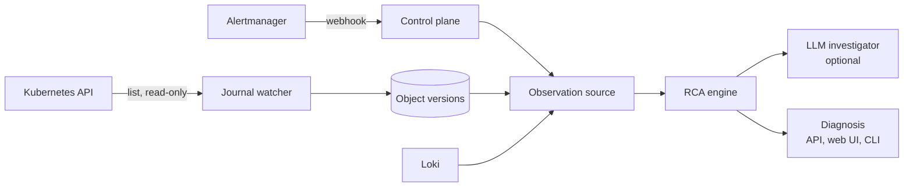

# Architecture

Agentic SRE turns an alert into a ranked, evidence-backed root cause with a
proposed fix. The same engine runs against a live cluster, the offline demo,
and ITBench-Lite snapshots.



## Components

| Path | Role |
| --- | --- |
| `packages/rca/model.py` | Entities, alerts, object versions, events, findings, hypotheses, diagnosis |
| `packages/rca/source.py` | `ObservationSource` protocol and an in-memory source |
| `packages/rca/topology.py` | Ownership, selectors, config references, HPA, policies, chaos targets, env-declared service calls |
| `packages/rca/signals.py` | Symptoms and findings: config/spec/image/scale changes, restarts, fault injection, network policies, quota rejections, container failures, resource pressure, dependency errors, warning events, HPA failures, and temporal traffic changes |
| `packages/rca/ranking.py` | Explainable scoring and deterministic verification rules |
| `packages/rca/hypotheses.py` | Evidence-coherent causal episode grouping and hypothesis diagnostics |
| `packages/rca/engine.py` | Pipeline: observe → signals → rank → investigate → verify → propose |
| `packages/rca/agent.py`, `llm.py` | Optional LLM investigator with read-only tools; opt-in OpenAI client |
| `packages/rca/remediation.py` | Proposed commands; never executed |
| `packages/rca/live.py` | Kubernetes reader, Loki reader, change watcher, live source |
| `packages/rca/report.py` | HTML for the web UI and static reports |
| `apps/control_plane` | FastAPI: Alertmanager webhook, incidents, diagnoses, web UI |
| `apps/cli` | `agentic-sre demo`, `diagnose`, `eval`, `grade`, `benchmark-qualify`, `hypothesis-report`, `serve` |
| `packages/evals/itbench` | Snapshot source, sealed predict/grade runner, ITBench grader |

## Pipeline

1. **Symptoms.** Diagnostic alerts define onset, alerting services, and
   namespaces. Recurring platform-health alerts (for example `Watchdog`) are
   counted and ignored.
2. **Signals.** Consecutive object versions are diffed; named list items such
   as containers and environment variables are matched by name, so a finding
   says `[payment].env[FAULT_DELAY_MS].value: 0 -> 2500`, not "spec changed".
   Chaos Mesh events, network policies (deny-all ones score higher than
   port or peer restrictions), and warning events add findings. A quota or
   LimitRange is a finding only when `FailedCreate` events show it rejecting
   pods, or when its `used` reaches `hard`. Pod status adds container
   failures (OOM kills, crash loops, image pull and config errors). Where
   metrics exist, memory-to-limit and CPU throttling of alerting pods are
   compared before and after onset; pressure that was already there is
   ignored. The live stack does not scrape cAdvisor yet, so this signal is
   benchmark-only for now.
   When an alerting service logs connection errors, its declared dependencies
   become suspects; shared infrastructure called by most workloads is skipped.
   Request-rate findings require a baseline-to-incident metric change; a high
   steady-state value alone is not treated as a load cause. HPA conditions and
   metric-failure Events are normalized with their controlled workload so an
   upstream autoscaler failure can be distinguished from a later workload
   failure.
3. **Hypothesis formation.** Entity identity is not hypothesis identity.
   Candidate evidence is grouped only when a directional causal path and
   temporally coherent initiating/supporting evidence connect the entities. A
   Deployment image change and a later owned Pod failure therefore form one
   hypothesis with the Deployment as actor and the Pod as manifestation. An
   unchanged Deployment does not absorb a Pod-local OOM merely because it owns
   that Pod. Findings are deduplicated by evidence identity for scoring while
   all provenance remains available for explanation.
4. **Ranking.** Each finding scores by kind, topology distance to alerting
   components, namespace, whether the change names an alerting service, and
   timing relative to onset. Warnings on the alerting component itself count
   for less, because they restate the symptom.
5. **Investigation.** With an investigator configured, the model sees the top
   candidates and may inspect them (`describe`, `history`, `events`,
   `neighbors`, `logs`) before choosing one. Invalid replies or budget
   exhaustion fall back to the ranking.
6. **Verification.** Rules decide the confidence label for the chosen
   candidate. Findings expose an onset delta and a temporal role
   (`INITIATING`, `SUPPORTING`, `CONSEQUENCE`, or `AMBIGUOUS`). A late linked
   change can remain a candidate but cannot verify the original incident onset;
   downstream-only evidence may produce `UNVERIFIED`. The structured
   `VerificationTrace` records passed, failed, weak, and unknown predicates
   without using an LLM.
7. **Remediation.** The causal actor maps to a reversible proposal:
   revert a ConfigMap, `rollout undo`, pause a chaos schedule, restore
   replicas, raise a quota or memory limit.

Alertmanager occurrence identity is `(fingerprint, starts_at)`. Repeated
delivery of one active occurrence is idempotent; after resolution, a later
firing with a new start time creates a new incident episode. The database
constraint is named `uq_alert_occurrence_fingerprint_starts_at`, so this
property also holds when duplicate webhooks arrive concurrently.

Object snapshots carry completed and failed namespace/kind scopes. Tombstones
are inferred only for a scope whose enumeration completed successfully; a
partial Kubernetes or optional Chaos Mesh listing is missing evidence, never
proof of deletion. A diagnosis cycle uses the cycle's completed observation
boundary for the current object/Event view rather than deriving a cutoff from
the last object mutation.

## Structural and causal topology

The topology keeps two questions separate. `Topology.reachable()` is an
undirected structural neighborhood used for UI, ownership lookup, and
investigation. RCA linking uses `causal_reachable()` and `causal_path()` with
the explicit `RELATION_SEMANTICS` table in `packages/rca/topology.py`.

The table documents whether a relation may be traversed in its stored or
reverse direction and gives the human-facing cause-to-symptom label. This
matters for Kubernetes owner references: the API stores
`Pod --owned_by--> ReplicaSet --owned_by--> Deployment`, while a Deployment
change can explain a Pod symptom through reverse traversal rendered as
`Deployment --owns--> ReplicaSet --owns--> Pod`. The same model covers
selectors, declared service calls, configuration use, policies, fault targets,
schedules, and scaling relationships. Unknown relations remain structural but
are denied during causal traversal. A causal path is stored as structured
`CausalHop` values on the candidate and diagnosis, so the engine can answer
why a candidate is connected without inventing evidence.

Shared ConfigMaps and broad NetworkPolicies remain direct candidates for their
own targets, but causal traversal does not use them as bridges between
unrelated sibling workloads. This is deliberate abstention from structural
connectivity, not a claim that the shared resource cannot itself be causal.

## Candidate evidence and causal hypotheses

The deterministic pipeline is explicitly:

```text
Finding → candidate evidence → Hypothesis → verification → Diagnosis
```

Kubernetes object identity is not causal-hypothesis identity. A hypothesis has
a stable ID, a `causal_actor`, member entities, manifestations, grouped
findings, evidence-role partitions, causal paths, and deterministic reasons.
For example, a Deployment image change followed by an owned Pod's
`ImagePullBackOff` is one episode: the Deployment is the actor, the Pod is a
manifestation, and the two findings retain their separate provenance. The
same ownership edge does not group an unchanged Deployment with a Pod-local
OOM, and sibling workloads are never grouped merely because they share a
namespace or resource.

Grouping requires both an allowlisted causal path and evidence coherence. A
Schedule can act as the actor for a spawned Chaos execution when the schedule
and injection findings establish that lineage; a directly injected Chaos
object remains its own actor. Evidence IDs are counted once for hypothesis
scoring, while duplicate references remain visible in the grouped provenance.
This layer represents episodes but does not yet resolve ambiguity between
separate hypotheses.

## Safety

- Cluster access is list/get/watch only, never Secrets
  (`infra/kubernetes/tools-rbac.yaml`, `make rbac-check`).
- Chaos Mesh experiments are only readable if `infra/kubernetes/chaos-mesh-rbac.yaml`
  is also applied (its own namespace, same read-only verbs). A failed resource
  scope is surfaced in snapshot metadata and never becomes a fabricated
  `OBJECT_DELETED` tombstone; optional fault-injection findings may be missing.
- Remediation is text; no code path applies it.
- Live model calls need `SRE_LLM_ENABLED=true` and `SRE_LLM_MAX_CALLS`; tests
  use scripted models.
- Benchmark prediction never reads ground truth; grading refuses unsealed or
  modified predictions.
- `seal.json` protects only the prediction manifest and prediction files.
  Grading is a separate phase and its generated `report.json`/`report.md` are
  protected by `report-seal.json`; `scripts/verify_release_provenance.py`
  checks both against the immutable release tag target.
- Kubernetes events are journaled the same way objects are (`event_versions`),
  because Kubernetes itself only keeps them for about an hour; without this, a
  resolved incident re-diagnosed later would silently lose event-based
  evidence. Storage is append-only, while `EventRepository.analysis_view()`
  selects the latest state visible by `observed_at` for each stable Kubernetes
  Event identity before RCA; changing `count` or `lastTimestamp` never creates
  multiple physical warning events in one replay. Historical replay includes
  explicitly configured evidence namespaces (`SRE_EVIDENCE_NAMESPACES`,
  default `chaos-mesh`) without treating unrelated evidence-namespace objects
  as application workload symptoms. Loki error lines captured by an open
  diagnosis are normalized into `log_observations`, so those captured records
  survive Loki retention. This is a bounded captured-observation journal, not
  a complete historical log archive: an incident resolved before diagnosis/log
  capture may have no persisted logs. Resolved replay never queries current
  Loki. An unavailable source is missing evidence, not a fabricated
  contradiction.
- `DiagnosisService`'s snapshot lock (`threading.Lock`) is per process. It is
  correct for today's single-worker, single-replica deployment
  (`infra/kubernetes/control-plane.yaml` runs one replica, no `--workers`).
  Running more than one worker or replica against the same database would
  reopen the read-then-write race it guards against; that needs a
  database-level lock (e.g. a Postgres advisory lock) before scaling out.
- The built-in local/demo deployment leaves read endpoints unauthenticated and
  setting `SRE_API_TOKEN` protects state-changing endpoints with a shared bearer
  token. The Kubernetes reader deliberately does not read Secret objects; that
  does not make incident, evidence, change-history, topology, or log-derived
  data safe for public exposure. Keep the control plane on a trusted network or
  put an external authentication boundary in front of it. The secured demo
  overlay also configures Alertmanager with the same operator-provided token;
  see `infra/kubernetes/secure-api-auth/`.
- `GET /incidents/{id}` is read-only and shows a pending state when no diagnosis
  exists. Diagnosis generation is the authenticated
  `POST /api/v1/incidents/{id}/diagnosis` action; a GET never snapshots,
  journals, calls Loki, invokes the optional investigator, or writes a result.
- There is no per-caller identity or rate limiting yet.

## Live validation and support boundary

`make e2e-kind` creates a disposable `agentic-sre` kind cluster, builds and
loads the repository images, deploys the demo stack, captures a baseline,
injects the real payment rollout fault, waits for the Prometheus → Alertmanager
→ control-plane webhook incident, diagnoses it, rolls the Deployment back, and
asserts both persisted Kubernetes Events and the object-journal A → B → A
sequence. It also replays the resolved incident and requires the same
deterministic verified cause. `make e2e-kind-clean` removes the named cluster.

The built-in deployment is intentionally limited to one control-plane replica
and one uvicorn worker. The snapshot lock is process-local; multiple workers or
replicas writing the same journal require database-level synchronization or a
dedicated single writer.

## Configuration

| Variable | Default | Effect |
| --- | --- | --- |
| `DATABASE_URL` | local PostgreSQL | Incident, journal, and diagnosis store |
| `SRE_CLUSTER_ACCESS` | off | Read the cluster with the pod or kube config identity |
| `SRE_WATCH_NAMESPACES` | `sre-demo` | Namespaces to journal and diagnose |
| `SRE_EVIDENCE_NAMESPACES` | `chaos-mesh` | Evidence-only namespaces retained for historical object/Event replay |
| `SRE_WATCH_INTERVAL_SECONDS` | `0` | Journal snapshot interval; `0` disables the watcher |
| `SRE_AUTO_DIAGNOSE` | off | Diagnose incidents as alerts arrive |
| `SRE_LOKI_URL` | unset | Read error logs for dependency findings |
| `SRE_LLM_ENABLED`, `SRE_LLM_MAX_CALLS`, `SRE_LLM_MODEL` | off, 0, `gpt-5.6-luna` | Optional LLM investigator |
| `SRE_API_TOKEN` | unset | Require `Authorization: Bearer <token>` on every write endpoint (`POST /api/v1/changes`, `.../diagnosis`, `.../cluster/snapshot`, `.../webhooks/alertmanager`); unset keeps them open, as the offline demo and kind walkthrough expect. Read endpoints remain unauthenticated in the built-in deployment but may expose operationally sensitive data. |
