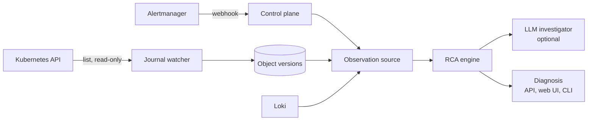

# Architecture

Agentic SRE turns an alert into a ranked, evidence-backed root cause with a
proposed fix. The same engine runs against a live cluster, the offline demo,
and ITBench-Lite snapshots.

## Components

| Path | Role |
| --- | --- |
| `packages/rca/model.py` | Entities, alerts, object versions, events, findings, diagnosis |
| `packages/rca/source.py` | `ObservationSource` protocol and an in-memory source |
| `packages/rca/topology.py` | Ownership, selectors, config references, HPA, policies, chaos targets, env-declared service calls |
| `packages/rca/signals.py` | Symptoms and findings: config/spec/image/scale changes, restarts, fault injection, restrictive policies, dependency errors, warning events |
| `packages/rca/ranking.py` | Explainable scoring and deterministic verification rules |
| `packages/rca/engine.py` | Pipeline: observe → signals → rank → investigate → verify → propose |
| `packages/rca/agent.py`, `llm.py` | Optional LLM investigator with read-only tools; opt-in OpenAI client |
| `packages/rca/remediation.py` | Proposed commands; never executed |
| `packages/rca/live.py` | Kubernetes reader, Loki reader, change watcher, live source |
| `packages/rca/report.py` | HTML for the web UI and static reports |
| `apps/control_plane` | FastAPI: Alertmanager webhook, incidents, diagnoses, web UI |
| `apps/cli` | `agentic-sre demo`, `diagnose`, `eval`, `grade`, `serve` |
| `packages/evals/itbench` | Snapshot source, sealed predict/grade runner, ITBench grader |

## Pipeline

1. **Symptoms.** Diagnostic alerts define onset, alerting services, and
   namespaces. Recurring platform-health alerts (for example `Watchdog`) are
   counted and ignored.
2. **Signals.** Consecutive object versions are diffed; named list items such
   as containers and environment variables are matched by name, so a finding
   says `containers[payment].env[FAULT_DELAY_MS].value`, not "spec changed".
   Chaos Mesh events, restrictive policies, and warning events add findings.
   When an alerting service logs connection errors, its declared dependencies
   become suspects; shared infrastructure called by most workloads is skipped.
3. **Ranking.** Each finding scores by kind, topology distance to alerting
   components, namespace, whether the change names an alerting service, and
   timing relative to onset. Warnings on the alerting component itself count
   for less, because they restate the symptom.
4. **Investigation.** With an investigator configured, the model sees the top
   candidates and may inspect them (`describe`, `history`, `events`,
   `neighbors`, `logs`) before choosing one. Invalid replies or budget
   exhaustion fall back to the ranking.
5. **Verification.** Rules decide the confidence label for the chosen
   candidate, for example "configuration changed near onset and is used by an
   alerting component or its dependency".
6. **Remediation.** The strongest finding maps to a reversible proposal:
   revert a ConfigMap, `rollout undo`, pause a chaos schedule, restore
   replicas.

## Safety

- Cluster access is list/get/watch only, never Secrets
  (`infra/kubernetes/tools-rbac.yaml`, `make rbac-check`).
- Remediation is text; no code path applies it.
- Live model calls need `SRE_LLM_ENABLED=true` and `SRE_LLM_MAX_CALLS`; tests
  use scripted models.
- Benchmark prediction never reads ground truth; grading refuses unsealed or
  modified predictions.

## Configuration

| Variable | Default | Effect |
| --- | --- | --- |
| `DATABASE_URL` | local PostgreSQL | Incident, journal, and diagnosis store |
| `SRE_CLUSTER_ACCESS` | off | Read the cluster with the pod or kube config identity |
| `SRE_WATCH_NAMESPACES` | `sre-demo` | Namespaces to journal and diagnose |
| `SRE_WATCH_INTERVAL_SECONDS` | `0` | Journal snapshot interval; `0` disables the watcher |
| `SRE_AUTO_DIAGNOSE` | off | Diagnose incidents as alerts arrive |
| `SRE_LOKI_URL` | unset | Read error logs for dependency findings |
| `SRE_LLM_ENABLED`, `SRE_LLM_MAX_CALLS`, `SRE_LLM_MODEL` | off, 0, `gpt-5.6-luna` | Optional LLM investigator |
