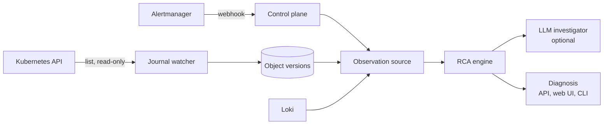

# Architecture

Agentic SRE turns an alert into a ranked, evidence-backed root cause with a
proposed fix. The same engine runs against a live cluster, the offline demo,
and ITBench-Lite snapshots.

## Components

| Path | Role |
| --- | --- |
| `packages/rca/model.py` | Entities, alerts, object versions, events, findings, diagnosis |
| `packages/rca/source.py` | `ObservationSource` protocol and an in-memory source |
| `packages/rca/topology.py` | Ownership, selectors, config references, HPA, policies, chaos targets, env-declared service calls |
| `packages/rca/signals.py` | Symptoms and findings: config/spec/image/scale changes, restarts, fault injection, network policies, quota rejections, container failures, resource pressure, dependency errors, warning events |
| `packages/rca/ranking.py` | Explainable scoring and deterministic verification rules |
| `packages/rca/engine.py` | Pipeline: observe → signals → rank → investigate → verify → propose |
| `packages/rca/agent.py`, `llm.py` | Optional LLM investigator with read-only tools; opt-in OpenAI client |
| `packages/rca/remediation.py` | Proposed commands; never executed |
| `packages/rca/live.py` | Kubernetes reader, Loki reader, change watcher, live source |
| `packages/rca/report.py` | HTML for the web UI and static reports |
| `apps/control_plane` | FastAPI: Alertmanager webhook, incidents, diagnoses, web UI |
| `apps/cli` | `agentic-sre demo`, `diagnose`, `eval`, `grade`, `serve` |
| `packages/evals/itbench` | Snapshot source, sealed predict/grade runner, ITBench grader |

## Pipeline

1. **Symptoms.** Diagnostic alerts define onset, alerting services, and
   namespaces. Recurring platform-health alerts (for example `Watchdog`) are
   counted and ignored.
2. **Signals.** Consecutive object versions are diffed; named list items such
   as containers and environment variables are matched by name, so a finding
   says `[payment].env[FAULT_DELAY_MS].value: 0 -> 2500`, not "spec changed".
   Chaos Mesh events, network policies (deny-all ones score higher than
   port or peer restrictions), and warning events add findings. A quota or
   LimitRange is a finding only when `FailedCreate` events show it rejecting
   pods, or when its `used` reaches `hard`. Pod status adds container
   failures (OOM kills, crash loops, image pull and config errors). Where
   metrics exist, memory-to-limit and CPU throttling of alerting pods are
   compared before and after onset; pressure that was already there is
   ignored. The live stack does not scrape cAdvisor yet, so this signal is
   benchmark-only for now.
   When an alerting service logs connection errors, its declared dependencies
   become suspects; shared infrastructure called by most workloads is skipped.
3. **Ranking.** Each finding scores by kind, topology distance to alerting
   components, namespace, whether the change names an alerting service, and
   timing relative to onset. Warnings on the alerting component itself count
   for less, because they restate the symptom.
4. **Investigation.** With an investigator configured, the model sees the top
   candidates and may inspect them (`describe`, `history`, `events`,
   `neighbors`, `logs`) before choosing one. Invalid replies or budget
   exhaustion fall back to the ranking.
5. **Verification.** Rules decide the confidence label for the chosen
   candidate, for example "configuration changed near onset and is used by an
   alerting component or its dependency".
6. **Remediation.** The strongest finding maps to a reversible proposal:
   revert a ConfigMap, `rollout undo`, pause a chaos schedule, restore
   replicas, raise a quota or memory limit.

## Safety

- Cluster access is list/get/watch only, never Secrets
  (`infra/kubernetes/tools-rbac.yaml`, `make rbac-check`).
- Chaos Mesh experiments are only readable if `infra/kubernetes/chaos-mesh-rbac.yaml`
  is also applied (its own namespace, same read-only verbs); without it the
  reader's chaos lookups fail silently, so fault-injection findings are
  quietly missing rather than erroring.
- Remediation is text; no code path applies it.
- Live model calls need `SRE_LLM_ENABLED=true` and `SRE_LLM_MAX_CALLS`; tests
  use scripted models.
- Benchmark prediction never reads ground truth; grading refuses unsealed or
  modified predictions.
- Kubernetes events are journaled the same way objects are (`event_versions`),
  because Kubernetes itself only keeps them for about an hour; without this, a
  resolved incident re-diagnosed later would silently lose event-based
  evidence. Storage is append-only, while `EventRepository.analysis_view()`
  selects the latest state visible by `observed_at` for each stable Kubernetes
  Event identity before RCA; changing `count` or `lastTimestamp` never creates
  multiple physical warning events in one replay. The journal still excludes
  the `chaos-mesh` namespace from its historical window query even when RBAC
  allows reading it live (only current, open-incident diagnosis sees chaos
  objects/events today).
- `DiagnosisService`'s snapshot lock (`threading.Lock`) is per process. It is
  correct for today's single-worker, single-replica deployment
  (`infra/kubernetes/control-plane.yaml` runs one replica, no `--workers`).
  Running more than one worker or replica against the same database would
  reopen the read-then-write race it guards against; that needs a
  database-level lock (e.g. a Postgres advisory lock) before scaling out.
- The built-in local/demo deployment leaves read endpoints unauthenticated and
  setting `SRE_API_TOKEN` protects state-changing endpoints with a shared bearer
  token. The Kubernetes reader deliberately does not read Secret objects; that
  does not make incident, evidence, change-history, topology, or log-derived
  data safe for public exposure. Keep the control plane on a trusted network or
  put an external authentication boundary in front of it. The secured demo
  overlay also configures Alertmanager with the same operator-provided token;
  see `infra/kubernetes/secure-api-auth/`.
- `GET /incidents/{id}` is read-only and shows a pending state when no diagnosis
  exists. Diagnosis generation is the authenticated
  `POST /api/v1/incidents/{id}/diagnosis` action; a GET never snapshots,
  journals, calls Loki, invokes the optional investigator, or writes a result.
- There is no per-caller identity or rate limiting yet.

## Configuration

| Variable | Default | Effect |
| --- | --- | --- |
| `DATABASE_URL` | local PostgreSQL | Incident, journal, and diagnosis store |
| `SRE_CLUSTER_ACCESS` | off | Read the cluster with the pod or kube config identity |
| `SRE_WATCH_NAMESPACES` | `sre-demo` | Namespaces to journal and diagnose |
| `SRE_WATCH_INTERVAL_SECONDS` | `0` | Journal snapshot interval; `0` disables the watcher |
| `SRE_AUTO_DIAGNOSE` | off | Diagnose incidents as alerts arrive |
| `SRE_LOKI_URL` | unset | Read error logs for dependency findings |
| `SRE_LLM_ENABLED`, `SRE_LLM_MAX_CALLS`, `SRE_LLM_MODEL` | off, 0, `gpt-5.6-luna` | Optional LLM investigator |
| `SRE_API_TOKEN` | unset | Require `Authorization: Bearer <token>` on every write endpoint (`POST /api/v1/changes`, `.../diagnosis`, `.../cluster/snapshot`, `.../webhooks/alertmanager`); unset keeps them open, as the offline demo and kind walkthrough expect. Read endpoints remain unauthenticated in the built-in deployment but may expose operationally sensitive data. |
