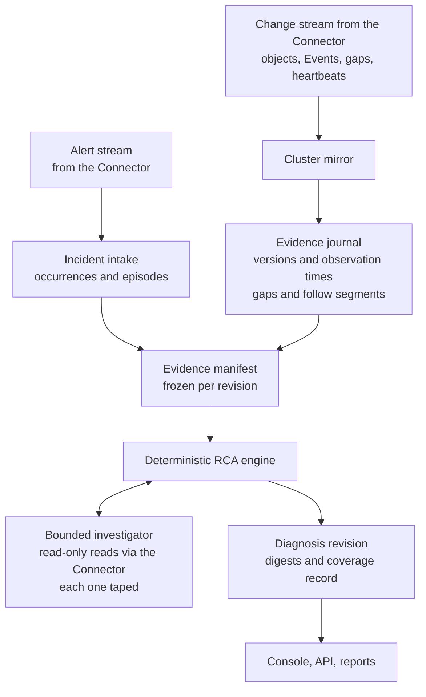
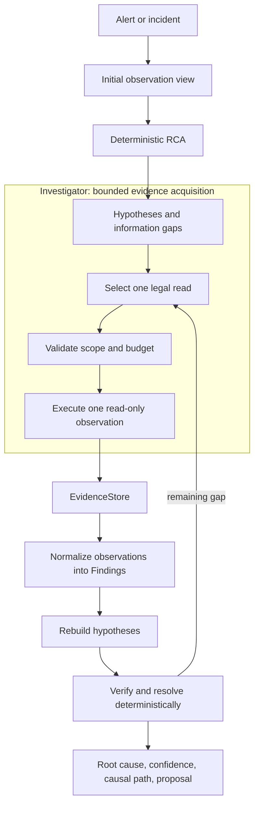

# How Agentic SRE works

The engine, the investigation runtime, the Connector boundary, the causal rules and the console in detail. Moved from the README, unchanged; the README keeps the summary.

## What is Agentic SRE?

Agentic SRE is a Kubernetes incident investigation and SRE root-cause
analysis system. It starts from an alert and an observation cutoff, identifies
candidate causal actors, explains how they can reach the affected workload, and
tests unresolved questions with a bounded set of legal read-only observations.

The investigator gathers evidence; it does not decide the root cause. Every
new observation returns through the same deterministic path:

```text
observation → EvidenceStore → normalization → Finding
            → hypothesis rebuild → verification → resolution
```

This separation makes an investigation auditable. A diagnosis includes the
selected root entity, confidence, resolution state, evidence, and causal path;
it does not rely on an opaque model answer.

## Core capabilities

### Evidence before answers

The engine does not ask a model to guess what caused an incident. It acquires
bounded evidence, normalizes that evidence into typed Findings, and rebuilds
the deterministic diagnosis.

### Deterministic judgment

The RCA engine owns verification, confidence, resolution, and root-cause
selection. An optional policy can choose among already-legal observation
actions, but it cannot create evidence, Findings, hypotheses, or a root cause.

### Bounded autonomous investigation

Investigation is a controlled state machine with explicit turn, tool, wall-time,
per-gap, invalid-action, and no-progress limits. It selects one validated read
at a time from a legal observation surface.

### Causal topology

The engine distinguishes structural connectivity from directional causal paths.
Ownership, configuration use, declared dependencies, policies, fault targets,
scaling relationships, and workload topology are interpreted as explicit
relations rather than generic graph proximity.

### Reproducible and safe by construction

The deterministic path produces repeatable trajectories for the same snapshot
and configuration. Kubernetes access is read-only, remediation is proposed
but never executed, and `NO_DATA` is neutral rather than evidence for a theory.

### Real-time evidence from inside the cluster

The Connector lists each scope once and then watches it, so a change is on the stream about a second
after the API server announces it. When a watch can no longer resume, only that scope is marked as a gap
and listed again; every other scope stays continuous ([watch path](#watch-driven-change-stream)).

### Knowing what it could not see

Evidence is admitted by when the Connector observed it, so a late delivery is not lost and hindsight is
not admitted. Each diagnosis records, per scope, whether observation was continuous and whether delivery
was proven, and continuity survives a restart of the control plane when the stream provably resumes where
it stopped ([evidence timing](#evidence-timing-and-coverage)).

### Honest presentation of uncertainty

The leader is chosen by the strength of its claim, not by a score alone, and the console shows a single
actor, **competing** actors or **not established** accordingly
([leading actor](#how-the-leading-actor-is-presented)).

### Incidents that follow the alert

An alert that resolves and fires again within a configurable quiet interval can continue its incident
instead of opening a new one, with the history kept intact; off by default
([alert episodes](#alert-episodes)).

## Architecture

Agentic SRE has five practical layers:

1. **RCA engine** — deterministic signals, causal hypotheses, verification,
   confidence, resolution, and remediation proposals.
2. **Investigation runtime** — bounded evidence acquisition through validated,
   read-only observation tools.
3. **Observation sources** — Kubernetes object versions and Events, Prometheus
   and Alertmanager context, Loki logs, traces, and configured snapshot data.
4. **Connector** — the only component that touches the customer environment;
   typed read-only requests and alert and change streams over an outbound mTLS
   connection ([boundary](#connector-boundary)).
5. **Control plane** — incident lifecycle, persistence, API, CLI, and HTML/UI
   reporting. In remote mode it holds no customer credential.

Inside the control plane, alerts and cluster changes become stored, replayable diagnoses:



The trust boundary is explicit:

- Kubernetes observation is read-only; Secrets are deliberately not read
  (enforced by RBAC and again by the Connector's deny list).
- The control plane holds no customer credential; the Connector only dials out.
- There is no arbitrary shell execution or autonomous cluster write capability.
- Remediation text is proposed for an operator and is never executed.
- Only in-scope, allowlisted observation capabilities can run.
- Invalid actions, duplicate reads, tool errors, `NO_DATA`, and exhausted
  budgets terminate safely with the current deterministic diagnosis.
- A diagnosis changes only after typed evidence is normalized into Findings and
  the hypotheses are rebuilt.

The built-in deployment is currently a single control-plane process/replica.
Read endpoints are unauthenticated by default and can expose operationally
sensitive incident and log-derived data, so deployment authentication and
network controls remain an operator responsibility.

## How does Agentic SRE find a root cause?



The runtime is orchestrated as a bounded LangGraph state machine:

```text
assess → select action → validate → execute one read
       → check novelty → normalize → rebuild hypotheses
       → check progress → repeat or finalize
```

LangGraph coordinates this state machine; it does not determine the root
cause. The same RCA and normalization code is used for initial observations and
new investigation evidence.

## What it investigates

Supported evidence depends on the configured observation sources, but the
engine understands these Kubernetes incident classes and signals:

- Deployment, ReplicaSet, Pod, ConfigMap, image, environment, and scale changes.
- Kubernetes Events, including warning events, failed scheduling, quota failures,
  container failures, and HPA metric failures.
- Dependency errors from bounded log observations and declared workload calls.
- Runtime traces and captured Loki observations when those sources are present.
- Network policy changes, resource pressure, quota/LimitRange behavior, and
  traffic changes when the corresponding observation data is available.
- Ownership, selectors, configuration references, service dependencies, HPA
  relationships, and other topology needed to build a causal path.

Captured logs are replayable evidence, not an unbounded historical log archive.
The engine reports when a signal is missing instead of treating missing data as
proof against a hypothesis.

## Connector boundary

The control plane never connects to a customer cluster. A **Connector** runs
inside the cluster, holds every credential, and **dials out** to the control
plane; nothing is exposed inbound. Contract:
[connector-boundary-contract.md](architecture/connector-boundary-contract.md).

```text
customer cluster                                    control plane
Kubernetes · Prometheus · Loki · Tempo · Alertmanager
        │ read-only, RBAC-scoped                    │ diagnoses, incidents, UI
   [ Connector ]  ── gRPC over mTLS, outbound ──▶  [ gateway ]
```

- **Typed, bounded, audited requests:** `list_objects`, `list_events`,
  `query_logs`, `query_resource_pressure`, `query_traffic`, `query_traces`,
  `capabilities`, `preflight`. No shell, no free-form query, no secrets.
- **Streams as cursor-paged reads:** `read_alerts` and `read_changes`, with
  epochs and explicit `Gap` records (connector restart, buffer expiry, backend
  unreachable). The alert-channel coverage window is derived from heartbeats, so
  the engine knows what it could not have seen.
- **Identity:** mTLS with a per-connector URI SAN. A Connector enrolls once
  with a one-time token, renews its certificate over the live session, and can
  be revoked; it is installed with the Helm chart `charts/agentic-sre-connector`
  ([install design](architecture/connector-install-design.md)). One
  control plane diagnoses through one Connector; multi-tenancy is not built yet.
- **Proven equivalent:** recorded real data survives the wire unchanged, and the
  direct and over-the-wire epistemic digests are identical on the migration gate.

The stream mode is opt-in (`SRE_CONNECTOR_STREAMS`); making it the default is
still an open decision.

### Watch-driven change stream

Inside the stream mode the Connector no longer polls the cluster on an interval. It lists each scope (a
namespace and a kind) once and then **watches** it, so a change is on the stream as soon as the API server
announces it; the control plane journals what arrives about once a second. Continuity is explicit: when the API
server can no longer resume a watch, only **that scope** gets a `Gap` and is listed again, and every other scope
stays continuous ([contract §15](architecture/connector-boundary-contract.md),
[design](architecture/connector-watch-design.md)).

| Measured on the lab (2026-09-30 / 10-01) | Polling every 15 s | Watch |
| --- | ---: | ---: |
| Event, source → journal, median / p90 | 21.5 s / 27.1 s | **1.2 s / 1.9 s** |
| API requests per minute | about 116 | **about 10** |
| Three-hour soak: failures / global re-snapshots | — | **0 / 0** |

Recovery is tested, not assumed: an API outage yields one gap and one paced resync rather than a storm, a
restarted or paused Connector resumes, and observed deletions (from a watch) are kept apart from inferred ones
(from a listing).

## Causal mechanism validation

Beyond naming a likely actor, the engine separates *possible* from *observed*
causes. A claim carries strong authority (`OBSERVED_MECHANISM_CAUSE`) only when
a rule shows an execution witness and an incident effect at the exact target
instance: for example a recorded quota rejection, or a chaos experiment with an
observed `Applied`/`Recovered` interval, connected to the incident's onset, and
an effect at the target inside that interval. `Spawned` or `Applied` alone confer
nothing; a Schedule carries the witness of the experiments it spawned by exact
UID. When the target pod is not itself a symptom, the witness may instead come
from the **service-level effect** read from live traces: calls from a symptom
service to that exact pod, inside the execution interval, fail or take far
longer than the same calls before the onset (at least three calls on each side,
a median above three times the baseline and above 0.2 s); too few calls leave
it unknown, never false. Timing stability is assessed across observation
cutoffs, and a sensitive witness withholds strong authority. `RESOLVED` additionally requires every
declared symptom to be covered, which is why it stays rare on purpose. Details:
[causal semantics](architecture/m21-causal-semantics-contract.md),
[timing stability](architecture/m21-timing-stability-contract.md).

### How the leading actor is presented

Ranking always produces a first candidate; that does not make it a cause. The engine first chooses the leader
by the **tier of its claim** (an observed mechanism over a plausible one over an unestablished one), and the
console then shows one of three things: a **single** actor, **competing** actors when the evidence ties them,
or **not established** when no candidate has evidence inside the incident window. Before the change, 23 of 122 testbed incidents (19%) led with an actor whose every finding was more than an hour
old, and a tied top score was broken by name order (the reported cause was decided that way in 14 ITBench
scenarios and 20 testbed incidents); both are now shown for what they are. The projection is presentation only: it
does not change the stored diagnosis or its epistemic digest.

### Evidence timing and coverage

A resolved incident's window freezes at its resolution. Two questions are kept apart
([design](architecture/late-evidence-design.md)):

- **What may a diagnosis use?** Evidence belongs to the window if the Connector **observed** it by the cutoff,
  however late it reached the control plane. Source times never decide membership, so no hindsight leaks in.
- **What may it conclude from absence?** Each diagnosis records, per scope, two separate dimensions: **source
  continuity** (`CONTINUOUS`, `GAPPED` with the gap intervals, or `UNKNOWN`) and **transport completeness**
  (`PROVEN` once the change stream, kept moving by a heartbeat, has been read past the cutoff; otherwise
  `NOT_PROVEN`). A diagnosis waits for that proof (bounded, 10 s). In live checks, delivery was proven in all
  60 measured waits (median about 2 s after the cutoff, longest 7.0 s); none timed out.
- **Continuity survives a restart.** The control plane records which Connector run it follows and how far it
  has read; a restarted process that provably resumes where the previous one stopped keeps the instant the
  stream has been followed since, instead of starting over as `UNKNOWN`.

The record is provenance today; rules that infer something from absence (an effect not seen before a fault, an
elimination, `RESOLVED`) will read it one at a time, each measured on the testbed first.

### Alert episodes

An alert that resolves and fires again within a configurable quiet interval (`SRE_ALERT_QUIET_SECONDS`) can
continue the same incident instead of opening a new one. The history is never rewritten: the timeline shows
`RESOLVED`, then `ALERT_REFIRED` with the gap, then `OPEN`, and the incident gets a new diagnosis revision.
The default is off ([contract](architecture/incident-episode-contract.md)).

## Operator console

A React/TypeScript operator console (`apps/web`) renders the deterministic
engine's output — it never computes a causal claim of its own. It has seven
screens: an **Overview** dashboard, a filterable **Incidents** list, the
**Incident workspace** (root actor, causal path, run-bound lifecycle, "why this
actor" vs competing hypotheses, evidence and trace), a **Changes** explorer,
a **Reports** library, **Connections** (connect a cluster, the Connector
registry, preflight, revocation) and read-only **Settings**.

**Investigation canvas.** In the incident workspace one selection is shared
across views: choosing a change, a finding, a graph node or a recorded
investigation step highlights it in the Causal X-Ray and scopes the evidence
explorer, and the canvas stays beside every task view. The X-Ray draws exactly the hops the
engine recorded; disconnected parts stay disconnected, with no link invented
to join them ([design](ui/investigation-canvas.md)).

```bash
make console   # builds the SPA, seeds a demo incident mix, serves it
```

Then open **http://localhost:8000/app**. Against a live cluster, `make ui`
port-forwards the same console to **http://localhost:8080/app**. The control
plane serves the built SPA under `/app` (with security headers and a strict
content-security policy); the JSON contract lives under `/api/v1/console/*` and
live updates stream over server-sent events (only persisted state transitions
reach the UI). The product contract is documented in
[docs/ui/product-contract.md](ui/product-contract.md).

**Reports.** Any incident with a diagnosis can be frozen into an immutable
report pinned to its `diagnosis_run_id`, exported as PDF / Markdown / JSON, and
shared by email (SMTP, when configured). A report never changes when the
incident is re-diagnosed.

Each incident page shows the diagnosis lifecycle with real recorded timestamps
and `T+` offsets:

```text
Alert fired → Incident opened → Diagnosis started
  → Evidence gathered (objects · journal · events · logs)
  → RCA engine completed (leading actor · reads)
  → Diagnosis stored (root cause · resolution)
```

So the page answers "how long from alert to root cause, and what was read to get
there" — with the model-call count shown alongside (zero on the deterministic
path). The [timeline design](diagnosis-timeline.md) documents the per-run
events behind it.

**Notifications.** When a new incident opens, and again when its diagnosis is
stored, the console shows a toast and a badge. They are derived only from
persisted incident state, so a reload or a missed stream event can never invent
or lose one.

> The console presents persisted incident state and the engine's diagnosis. It
> does not make causal claims or change the RCA logic measured in
> [Measured performance](results/measured-performance.md).
