# Operator Console screenshots

These are browser captures of the actual frontend served from a production build,
using the repository's `scripts/seed_console_demo.py` data in a separate local
database. They are not mockups or live production incident records. Captured during
the Investigative Graphite redesign; relative ages and recorded timestamps reflect
that capture session.

## Operational overview

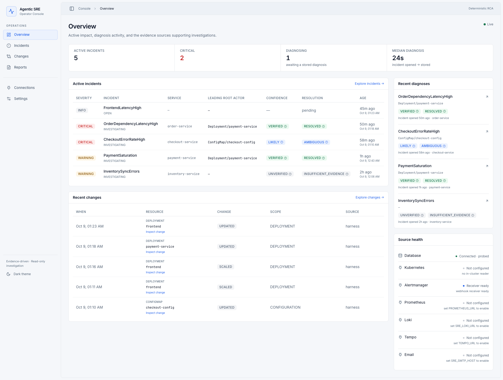

## Incident explorer

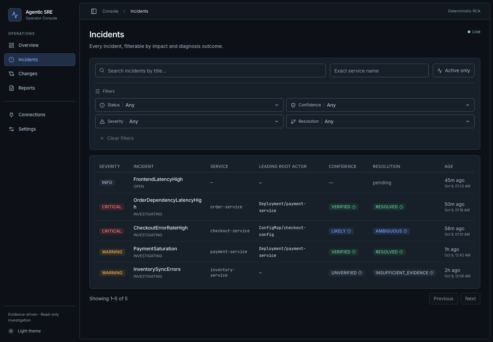

## Incident workspace

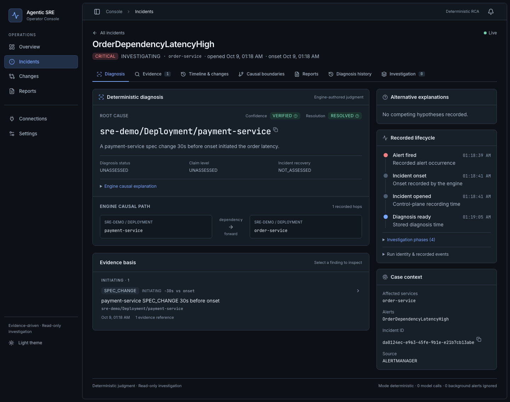

## Ambiguous diagnosis

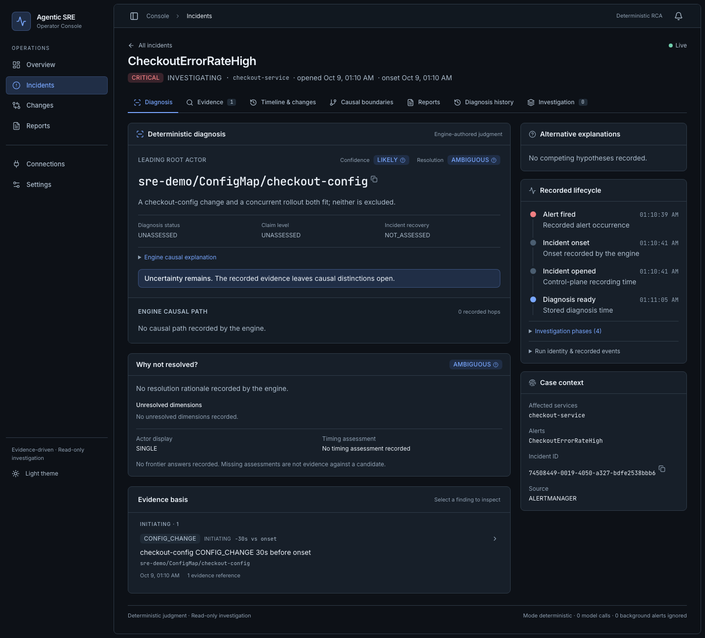

## Incident chronology

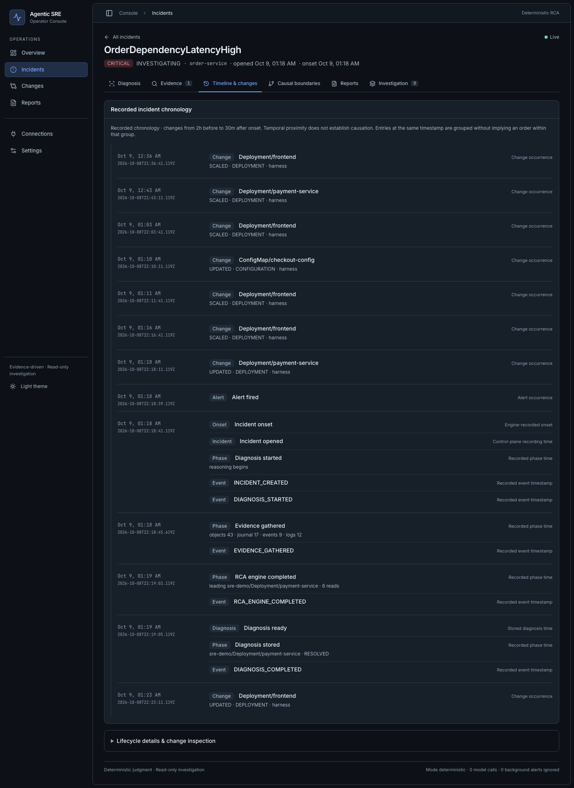

## Evidence explorer

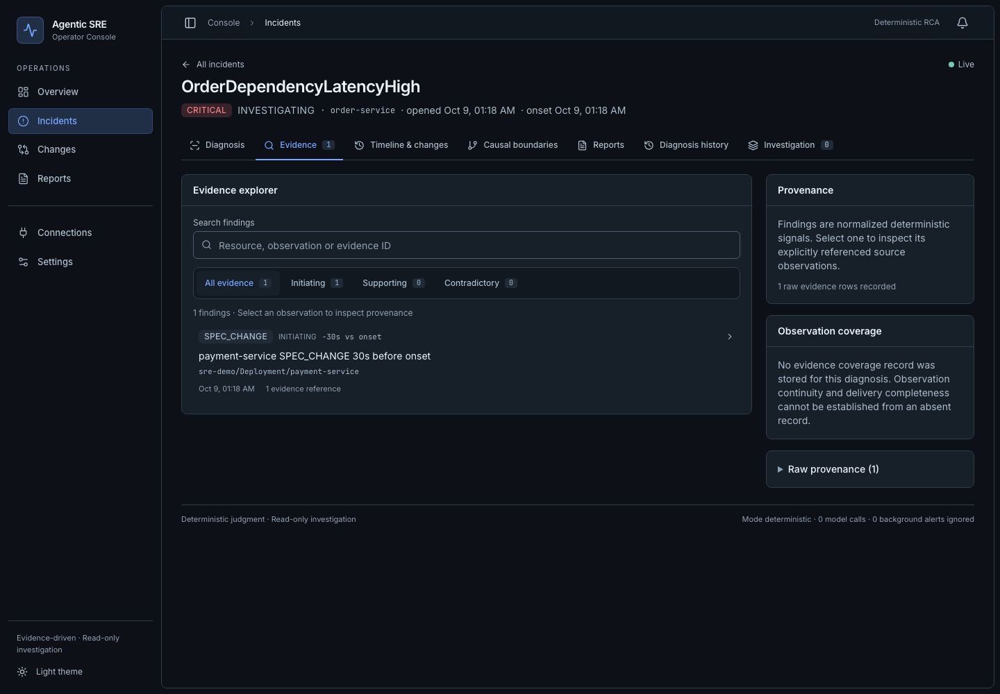

## Evidence inspector

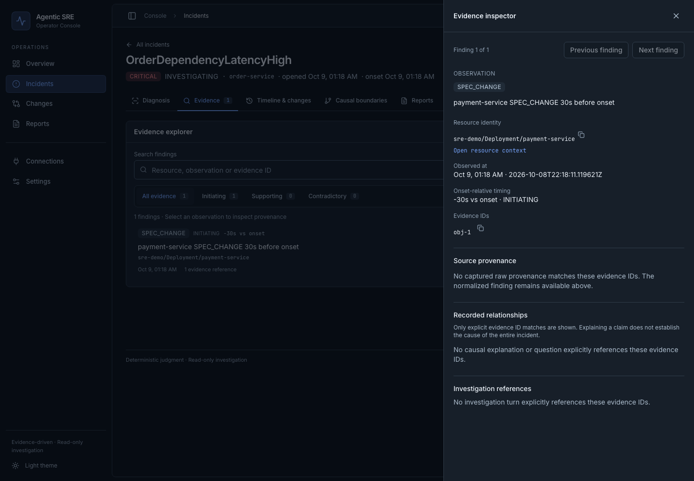

## Resource inspector

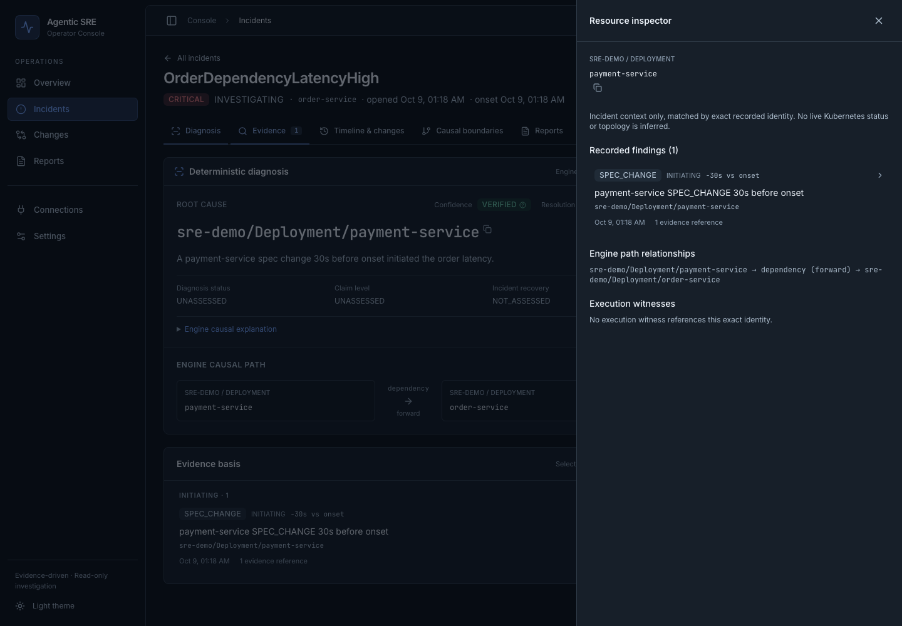

## Diagnosis history

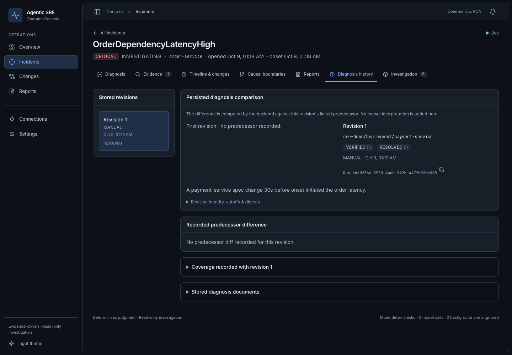

The repository seed contains one revision for this incident, so no predecessor
comparison is invented. Multi-revision diffs, recorded actions, and coverage gaps
are verified separately with explicit browser-test fixtures.

## Changes

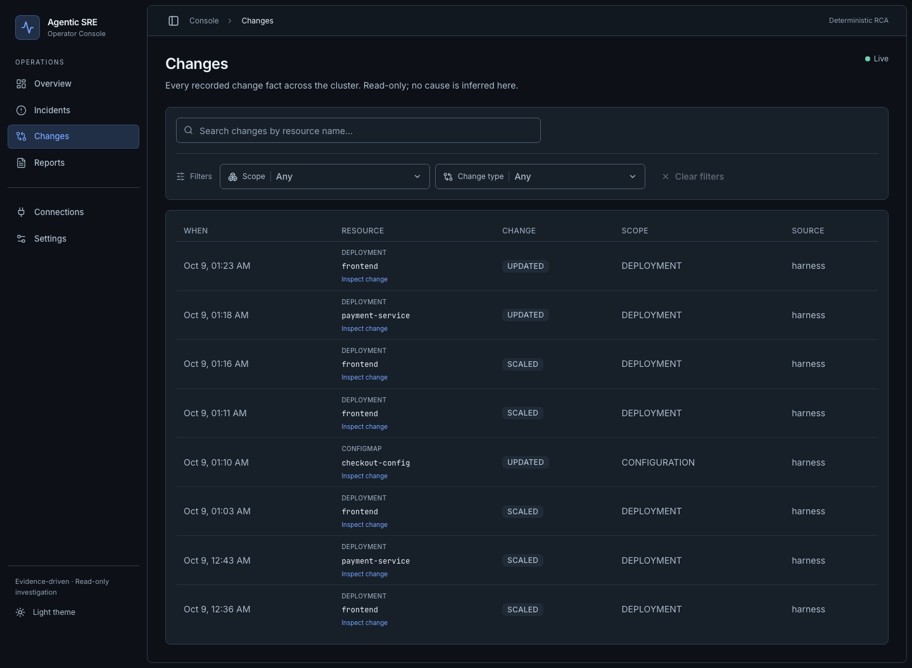

## Reports

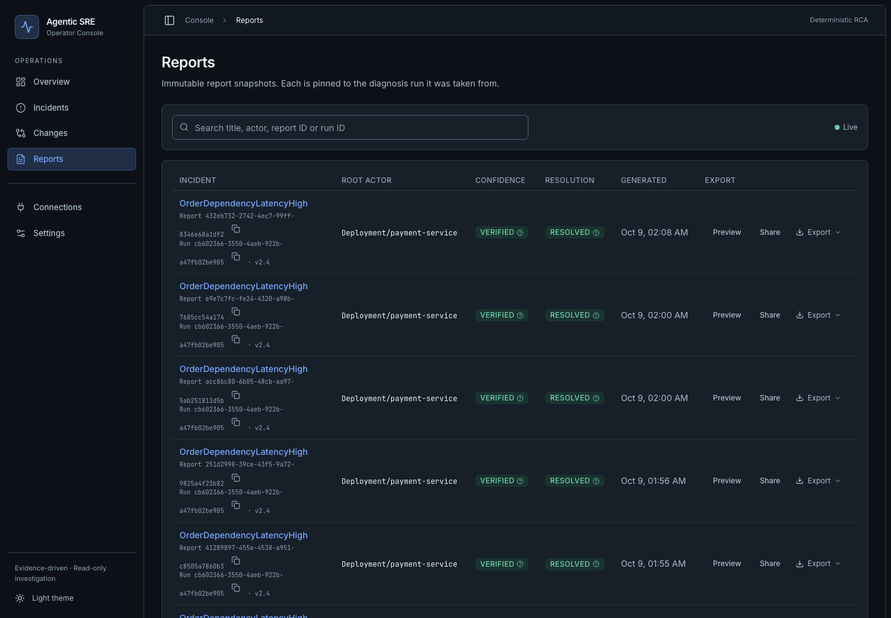

## Light-theme workspace

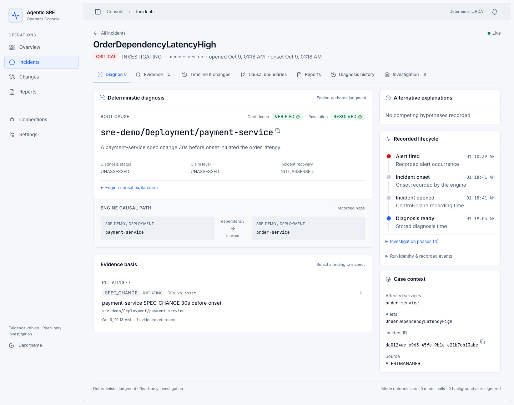

## Mobile workspace

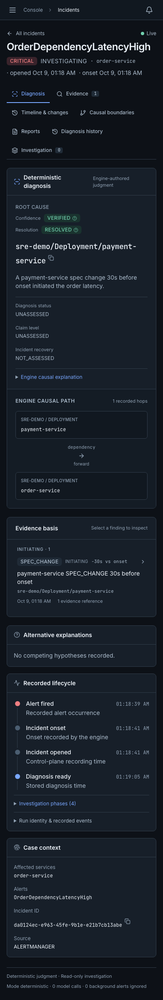

## Notification center

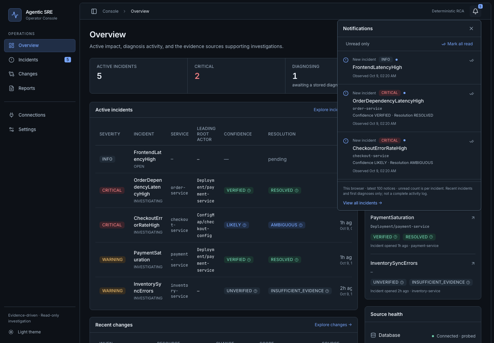

This capture replays the repository-provided seeded incident list against an empty
remembered browser baseline to demonstrate the notification menu. Notice times are
browser observation times; the first visit normally establishes a silent baseline.

For implementation details, verification results, and capture limitations, see the
[redesign verification report](../redesign-verification.md).
